这里记录着关于`汉语分词`的论文的阅读笔记。

## 1. 基于案例的分词消歧学习：初步研究

论文地址: [Learning Case-based Knowledge for Disambiguating Chinese Word Segmentation: A Preliminary Study](https://www.aclweb.org/anthology/W02-1808)

作者：香港城市大学 中国翻译和语言学院：吉-春雨（Chunyu Kit），潘海华（Haihua  Pan）。中国广东省对外贸易经济合作部：陈红标（Hongbiao Chen）。

论文领域：基于 exmaple 的汉语分词消歧（Disambiguate CWS within the example-based approach）.

### 基本介绍

1. 歧义类型：`overlapping`, `combinational`.

   * overlapping: 给定字串 &alpha; a &beta;  ，&alpha; a &subset; D, a &beta; &subset; D. 
   
   * combinational: 给定字串 &alpha;  &beta; , (&alpha; , &beta;, &alpha; &beta; ) &subset; D.

   通常这两种歧义会一起出现，而组合型歧义可以通过`最大匹配（MM）` 的策略解决。所以主要目标是解决重叠型歧义。

2.    歧义检测：利用 FMM 和 BMM 的输出之间的矛盾，可以检测出歧义（高效，但是不能检测出全部的歧义）。

### 作者的方法

1. 基于 `case-based` learning 框架解决歧义，也成为 `memory-based`, `instance-based`, `example-based`.

2. *`example`* 的定义：定义为一个四元组：*`<C^l^, e, C^r^, S>`*:

   * C^l^, C^r^: 歧义字串 e 出现的左右上下文。
   * e: 出现歧义的字串。
   * S: 在特定上下文中 e 的正确划分（Segmentation）.

3. `distance` 或 `similarity` 的定义：给定歧义字串 `a` 下的 `example` `E` 和一个三元组 *`A=<C^l^, a, C^r^>`*, 则距离定义为：

   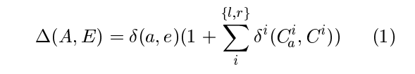

   其中：&delta; (., .) 表示两个字符串是否相等：

   

   而 &delta; ^i^(., .) 则表示在对应上下文中的相似性，衡量的是公共后缀（右侧context）和公共前缀（左侧context）的长度。（即 FMM 和 BMM 的公共字串长。）将公共前缀长和公共后缀长表示成 f^l^(.,. ) ， f^r^(,., ) ，

   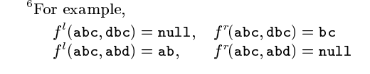

   那么公式（1）改写成：

   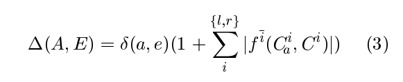

   只有当 &Delta; (A, E) > 1 时才有意义，因为此时两个字符串是相等的，而 a, e 分别对应于 FMM 和 BMM 的输出。

4. 给定一个三元组 `A=<C^l^, a, C^r^>` 和 `E` 的集合`&varepsilon;`  ，分词的策略为：

   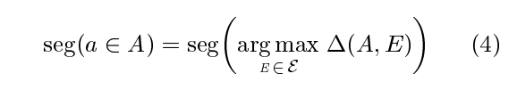

   即：找到与 A 最相似的 E.

5. 实现的算法：首先通过一个歧义检测程序收集 examples，再将这些 examples 应用于一个 example application。

   1. Ambiguity detection

      By detecting the discrepancies of the output from the FMM and BMM segmentation. 

      给定一个语料库 C, 检测算法如下：

      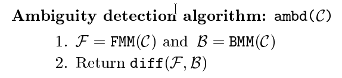

      **注：** 应注意到仍然有许多的歧义没有被检测到。

   2. Disambiguation

      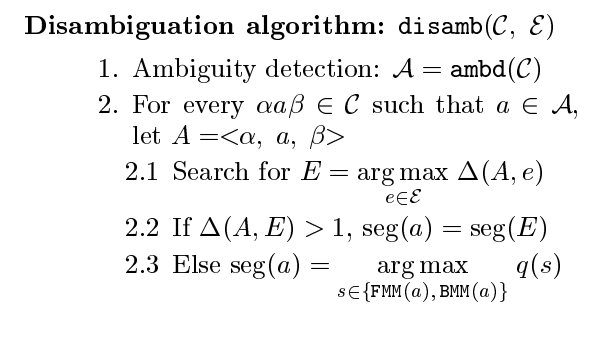

      其中, q(·) 是一个划分的概率似然值，

      

      其中，P~w~(·) 是一个字串组成词的概率：

      

      其中，f~w~(·) 和 f(·) 分别是 组成词 和 单词成词 的频率。我们可以基于 FMM 计算出词频。

### 消歧准确率

1648 个歧义的词，处理了 1488 个，消歧准确率为 90.29% .

优点：简单，有效。

缺点：依靠歧义检测算法检测歧义。而且当 &Delta; (A, E) <=1 时，切分还是使用了 统计方法，只是缓解了分词消歧的问题（为了提高一点点准确率），并没有真正的解决问题。

## 2. 使用归纳学习的自适应分词方法

A Word Segmentation Method with Dynamic Adapting to Text Using Inductive Learning. （2002）

作者：Hokuto 系统有限公司：中建王（Zhongjian Wang）; 北海道大学工程研究所：Kenji Araki; 北开学园大学工商管理研究生院: Koji Tochinai.

提出的方法：类似统计的 N-Gram 模型，在文章中找出出现频率较高的词可能可以作为一个独立的词。

## 3. 基于最大匹配和字约束力的中文分词

Chinese Word Segmentation  based on Maximum Matching and Word Binding Force. (1996， citation: 113)

作者：香港大学，计算机系：Pak-kwong Wong , Chorkin Chan .

提出的方法：提出了基于 FMM 和 字约束力（word binding force）的中文分词方法。

没有什么新东西，只是 FMM 而已。

## 4. 一种中文分词词典新机制 ---  双字哈希机制

A New Dictionary Mechanism for Chinese Word Segmentation. (2003, citation: 55) 

作者：清华大学，计算机系：李庆虎 ,陈玉健 ,孙家广。

论文领域：基于字典的汉语分词，词典加速。

### 介绍

基于词典的分词方法：FMM, BMM, 全切分法。

3种典型的词典机制：

1. 基于整词二分的分词词典机制；
2. 基于TRIE索引树的分词词典机制；
3. 基于逐字二分的分词词典机制。

**基于整词二分的分词词典机制**

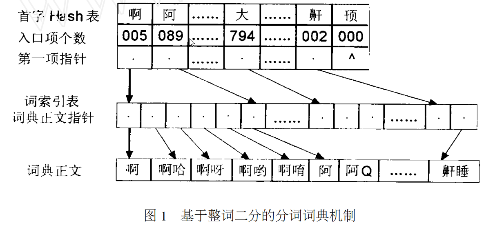

第一层为首字散列表，包含入口项个数（就是组成的词的个数）和第一项指针；第二层为词索引表，从第一项指针开始，共入口项个词都是以首字为开头的词语。

**基于TRIE索引树的分词词典机制**

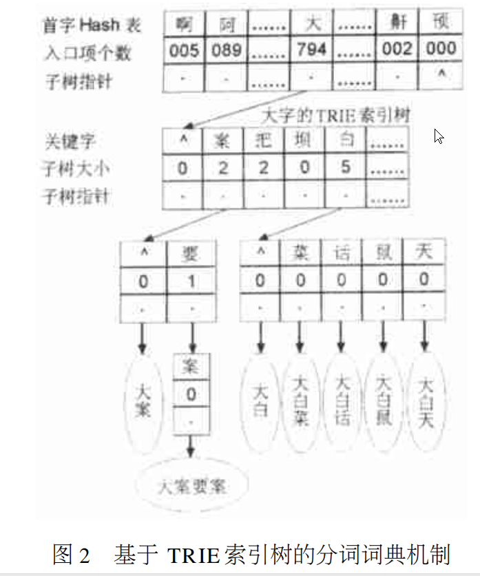

第一层和基于整词二分的词典机制相同，第二层是TRIE树的树节点。TRIE索引树的优点是在对被切分语句的一次扫描过程中 ,不需预知待查询词的长度 ,沿着树链逐字匹配即可;缺点是它的构造和维护比较复杂 ,而且都是单词树枝(一条树枝仅代表一个词) ,浪费了一定的空间。

**基于逐字二分的分词词典机制**

这是前两种方式的改进方案。逐字二分与整词二分的词典结构完全一样 ,只是查询过程有所区别 :逐字二分吸收了 TRIE 索引树的查询优势 ,即采用的是“逐字匹配”,而不是整词二分的“全词匹配”,这就一定程度地提高了匹配的效率。但由于采用的仍是整词二分的词典结构 ,使效率的提高受到很大的局限。

### 作者的方法 ---双字哈希索引分词词典机制

基本前提：在一个容量为 42425 条的通用词典（THCADict）中统计到，单字词个数为 1650, 双字词个数为 30770 条，共 32420 条，占比 76.42%。由于多字词占比不高（？），并且使用的频率更低，基于这个统计特点，提出了新机制。

双字哈希索引词典机制：对前两个字顺次建立 Hash 索引，构成深度仅为 2 的 TRIE 子树，词的剩余字符串则按序组成类似 “整词二分” 的词典正文。词典结构如下：

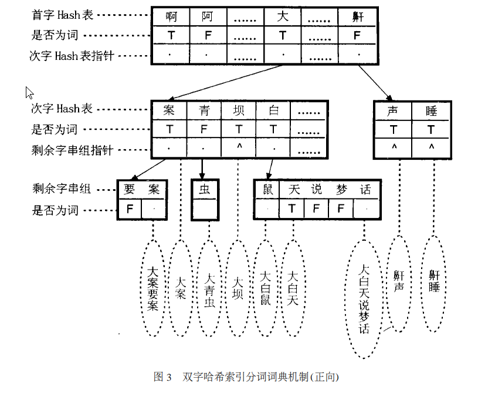

这样，在存储空间和查找效率上做了一个 trade off.

存储空间：TRIE 索引树 > 双字 Hash 索引 > 整词二分 = 逐字二分。

处理时间：双字 Hash 索引 > TRIE 索引树 > 逐字二分 > 整词二分。

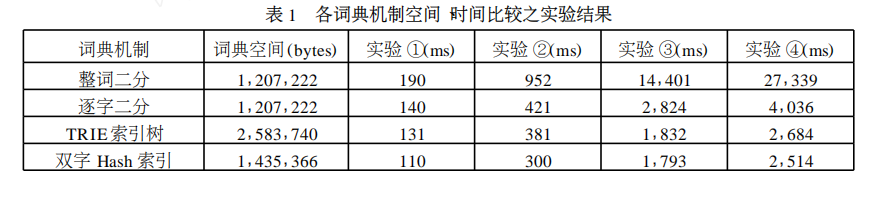

双字哈希索引**正向**分词词典适用于 FMM。

## 5. Sighan 2005 条件随机场汉语分词

 A Conditional Random Field Word Segmenter for Sighan Bakeoff 2005 .

作者：科罗拉多大学(Colorado) 语言学院：Huihsin Tseng ；斯坦福大学 自然语言处理小组：Pichuan Chang, Galen Andrew, Daniel Jurafsky, Christopher Manning .

### 介绍

2005 年 Sighan Backoff 包括4种语料库： Academia Sinica(AS), City University of Hong Kong(HK), Peking University(PK), 和 Microsoft Research Asia(MSR)。每一种语料库都有自己对单词（word）的定义。

### CRF 算法

`CRF`是一个统计序列模型（[Lafferty, John, A. McCallum, and F. Pereira. 2001.  Conditional Random Field: Probabilistic Models  for Segmenting and Labeling Sequence Data. In ICML 18.](http://repository.upenn.edu/cgi/viewcontent.cgi?article=1162&context=cis_papers)），使用 `CRF` 做汉语分词，通常是将其作为一个 二元分类任务，即: `单词开头，单词延续`。模型使用 Character identity, morphological and character reduplication features.  2004 年 Peng 等人第一次使用 CRF 实现汉语分词（[Peng, Fuchun, Fangfang Feng and Andrew  McCallum. 2004. Chinese segmentation and new  word detection using conditional random fields. In COLING 2004.](https://dl.acm.org/citation.cfm?id=1220436), 将 每个字标注为词的开头或者是词的延续，并且使用 Gaussian 先验分布以防 overfitting，使用拟牛顿法（quasi-Newton method）来优化参数。

```
Y: The label sequence for the sentence.
X: The sequence of unsegmented characters.
Z(X): Normalization term.
f_k: 特征函数，状态转移 or 发射函数
```

那么，条件随机场为：

$$P_{\lambda}(Y|X) = \frac{1}{Z(X)} exp(\sum_{c}\in{C} \sum_{k} \lambda_k f_k(Y_c, X, c))$$

CRF 可以使用 N-Gram 特征以及其他特征比如 形态特征。

### 特征工程(Feature engineering)

#### 特征

在我们的模型中使用的主要特征有 3 种： `character identity n-grams`, `morphological` and `character reduplication features`。

1. 对每个状态（state），字符身份特征使用特征函数表示成 3 种身份：the current, proceeding and subsequent positions. 特别的，我们使用了 4 种 Unigram 特征: $$C_0$$( current character), $$C_1$$(next character), $$C_{-1}$$(previous character), $$C_{-2}$$(the character two characters back.). 此外，可以使用 Bigram  特征：$$C_0C_1$$, $$C_{-1}C_0$$, $$C_{-1}C_{1}$$, $$C_{-2}C_{-1}$$, $$C_{-2}C_{0}$$.

2. 通常 未登录词 会比一个字更长，因此可以使用形态特征来解决 未登录词 的问题。
3. 另外，还使用了 字重复 特征函数，用来识别？？？。

表1是每个语料库中特征个数和 &lambda; 个数：

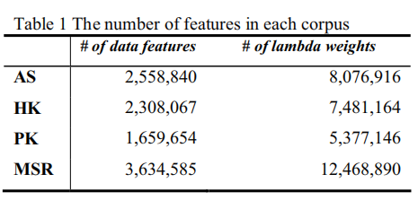

#### 实验

在 Sighan backoff 2003 上的结果：

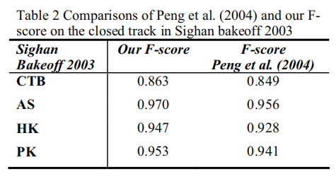

可以看到，在 4 个数据集上，该系统的 F-score 均比 2004 年 Peng. 的要好。

这里有句很气人的话。。。

>  We do not at present have a good  understanding of which aspects of our system give it superior performance.

在 Sighan backoff 2005 上的结果：

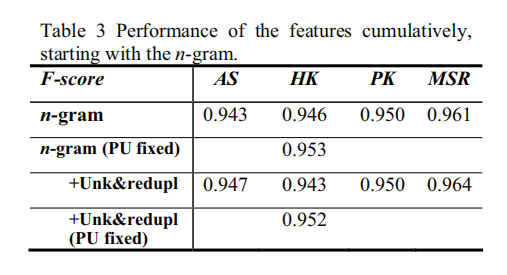

第一行是只使用了 字特征的 F-score, 后面的还使用了 形态特征 和 字重复 特征，在 AS 和 MSR 上面的表现要好于 HK 和 PK 上的，表明该系统更擅长于在 更长分词标准上分词。

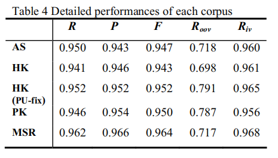

**注：**按**字**分词的首发文献：薛念文 [Xue, Nianwen and Libin Shen. 2003. Chinese Word Segmentation as LMR Tagging. In SIGHAN 2.](https://dl.acm.org/citation.cfm?id=1119278)

## 6. 条件随机场：划分和序列数据标注的概率模型

Conditional Random Fields: Probabilistic Models for Segmenting and Labeling Sequence Data. 2001.

作者：卡纳基梅隆大学(CMU)：John Lafferty; UMASS: Andrew Mccallum; 宾夕法尼亚(Pennsylvania)大学(UPenn): Fernando C.N. Pereira.

论文贡献：提出了 条件随机场（Conditional random fields, CRFs）, 一种用于序列数据划分和标注的概率模型框架。CRFs 放松了 Markov 模型的强独立性假设（会忽略上下文信息），也避免了MEMMs 和 一些其他的 判别式马尔克服模型的 根本限制，这些限制会使得 state 偏向于更少 succesor 的 state. 最后利用 迭代参数估计算法 估计参数。

### 介绍

HMMs and stochastic grammars 是生成式模型，通常是使用 MLE 优化。缺点是不能解决长范围依赖问题。

MEMMs （Maximum entropy Markov models）是判别式模型，可以解决长依赖问题。缺点是由 *the label bias problem*   , 即会使得状态偏向于更少继承状态少的状态。

CRFs 既具有 MEMMs 的优点，也解决了 the label bias 问题。CRFs 和 MEMMs 的主要区别在于 MEMMs 对每个在当前状态下的下一状态的条件概率都是一个 指数模型（exponential model），而 CRFs 使用一个单一的指数模型在给定观察序列上的整个标注的序列的联合概率。

### The label bias problem

状态偏向于更少继承状态少的状态。

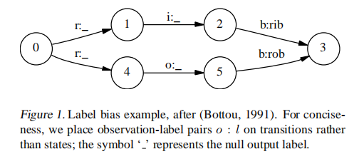

### 条件随机场

```
X: 未标注的序列数据上的随机变量，eg. 自然语言语句；
Y: 已标注的序列数据上的随机变量，eg. POS；
Yi ~ y (希腊字母，有限的标注集合)，eg. 词性集合；
```

在判别式模型中，构建一个如下的条件模型：$$P(Y|X)$$, X 和 Y 是 paired observation and label sequence.

**CRF 定义：** $$G=(V, E)$$ 是一个图，$$Y=(Y_v)_{v \in V}$$，所以 $$Y$$ 是图 G 中的顶点（vertices）。当在给定条件下，随机变量服从马尔可夫属性：$$P(Y_v|X, Y_w, w \neq v) = P(Y_v | X, Y_w, w~v)$$ ， 其中 $$w~v$$ 表示$$w$$ 和 $$v$$ 邻接，那么 $$P(Y|X)$$是条件随机场。


在论文中，假设图 G 是固定的，简单假设 G 如下：$$G=(V={1,2,...,m}, E={Y_1, Y_2, ..., Y_n})$$， 表示一个线性、链式的图，并假设序列 $$X=(X_1, X_2, ..., X_n), Y=(Y_1,Y_2, ..., Y_n)$$。

如果 G 是树的形式，那么它的团（Cliques）就是它的点和边。因此，由随机场基础理论（Hammers & Clifford, 1971），**X, Y 联合分布如下** ： 

$$P_{\theta}(y|x) \propto exp(\sum_{e \in E, k} \lambda_k f_k (e, y|_e, x) + \sum_{v \in V, k} \mu_k g_k(v, y|_v, x)) ------ (1) $$


**参数估计问题：** 参数向量：$$\theta = (\lambda_1, \lambda_2, ...; \mu_1, \mu_2, ...).$$  $$ D={(x^(i), y^(i))}_i^N $$ 是训练集合，经验分布：$$\widetilde{p}(x, y)$$. 

利用迭代缩小算法(iterative scaling algo.)最大化 log-likelihood 对象（优化目标）：

$$O(\theta) = \sum_{i=1}^N log p_{\theta}(y^{(i)}|x^{(i)}) \propto \sum_{x, y} \widetilde{p} (x, y) log p_{\theta} (y|x) $$.

特别地，定义两组特征：

* 状态转移特征：$$f_{y^`, y}(<u, v>, y|_{<u,v>}, x) =\delta(y_u, y^`)\delta(y_v, y)$$
* 发射特征：$$g_{y, x}(v, y|_v, x) = \delta(y_v, y)\delta(x_v, x)$$

$$<u, v>$$ 是一条边，对应参数 $$\lambda_{y^`, y}$$ 和 $$\mu_{y,x}$$ 分别是 $$p(y^`|y)$$ 和 $$p(x|y)$$ 的影响因子。

正则化项：$$Z(X)$$ 决定于观测值的正则化。


对于（1），对于观察序列 x 的每个位置 i, 我们定义随机变量矩阵 $$|Y| \times |Y|$$: $$M_i(x) = [M_i(y^`, y|x)]$$.

$$M_i(y^`,y|x) = exp(\bigwedge_i(y^`, y|x)),\\ \bigwedge_i(y^`, y|x) = \sum_k \lambda_k f_k(e_i, Y|_{e_i}=(y^`, y), x) + \sum_k \mu_k g_k(v_i, Y|_{v_i}=y, x)$$ 

其中，$$e_i$$ 是  $$labels(Y_{i-1}, Y_i)$$ 的边，$$v_i$$ 是 $$label$$ 的 $$Y_i$$ 的顶点。


**训练判别式模型：**

$$Z_{\theta}(X) = (M_1(X) M_2(X) ... M_{n+1}(X))_{start, stop}$$,  那么条件概率可以表示成：（链式）

$$ p_{\theta}(y|x) = \frac{\prod_{i=1}^{n+1} M_i(y_{i-1}, y_i|x)}{\prod_{i=1}^{n+1}M_i(x)_{start, stop}}, Y_0 = start, Y_{n+1}=stop. $$


#### CRFs 的参数估计

<!-- TODO -->


## 7. 基于 LMR 标记的汉语分词

Chinese Word Segmentation as LMR Tagging. 2003

作者：UPenn：薛念文，沈李冰

提出：将汉语分词作为 LMR 序列标注问题。利用 MEMMs 实现。

最终结果( F-score ): AS : 95.9%, UK: 91.6%.

### 介绍

分词的两大难点：词性消歧, 未登录词识别。

将汉语分词问题作为**汉字**标注问题的理由：

1). 汉语中的词通常不超过四个汉字。因此， the number of positions is small.

2). 虽然在原则上每个汉字可出现在任意位置，但并非每个字都这样。汉字的潜在数量服从一种限制。eg. '们'通常出现在词尾。

3). 虽然汉语中的词不能完全的列出，且新词受限于已有的语料。但汉语中汉字的数量是相对稳定的。

### 标记（Tag）

论文提出，假设一个汉字有 4 种不同的 tags:

1. **LM**: 词的左边缘（ the left periphery of a word ）；
2. **MM**: 词的中间，词干（ the middle of a word ） ；
3. **MR**: 词的右边缘（ the right periphery of a word ）；
4. **LR**:  单字成词（ *hanzi* that is a word by itself ）。

称之为 LMR 序列标注。

因此，汉语分词问题处理成为每个汉字赋值一个 LMR 标记的问题， 而整个句子转换成一个 LMR 序列。四个标签的使用在语言学上是直观的，因为 LM 标签语素( morphemes ) 是前缀或词干，没有前缀；MR 标签语素是后缀或词干，没有后缀；MM 标签语素是词干，有词缀；LR 标签词干，没有词缀。

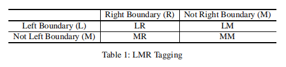

### 标注算法

论文中提出两步的标注算法：1). 正向反向 MEMMs 标注；2). Transformation-Based Learning.

#### MEMMs 标注算法

定义在 $$H \times T$$ 上的概率模型，

*  $$H$$: 可能的上下文或 “histories” 集合; 
* $$T$$: 可能的标注集合（ possible set of tags ）.

则，模型的联合概率定义为：$$ p(h, t) = \pi \mu \sum_{j=1}^k \alpha_j^{f_j(h, t)} \dots (1) $$ ，就是一个似然函数，将所有的特征相乘。

* $$\pi$$: 正则化常量；
* $$\{\mu, \alpha_1, \alpha_2, ..., \alpha_k \}$$: 模型参数；
* $$\{ f_1, f_2, ..., f_k \}$$: 特征函数；$$f_k(h, t) \in \{0, 1\}$$

给定训练样本，字序列：$$\{c_1, c_2, ..., c_n\}$$, 标注序列：$$\{t_1, t_2, ..., t_n\}$$, 优化目标--最大化似然：

$$ L(p) = \prod_{i=1}^n p(h_i, t_i) = \prod_{i=1}^n \pi \mu \sum_{j=1}^k \alpha_j^{f_j(h, t)} \dots (2)$$

注：这里可以转换成 Log-likelihood 。

**选择哪些特征 $$f_k(h_i, t_i)$$ ？**

(1) Feature templates
(a) Default feature
(b) The current character $$(c_0)$$.
(c) The previous (next) two characters $$(c_{-2}, c_{-1}, c_{+1}, c_{+2})$$.
(d) The previous (next) character and the current
character $$(c_{-1}c_0, c_0c_{+1})$$, 
the previous two characters $$(c_{-2}c_{-1})$$, and
the next two characters $$(c_{+1}c_{+2})$$.
(e) The previous and the next character $$(c_{-1}c_{+1})$$.
(f) The tag of the previous character $$(T_{-1})$$,the tag of the character two before the current
character $$(T_{-2})$$.

#### Tranformation-Based Learning

MEMMs 存在 *the label bias problem (LBP)* 问题，可以使用 CRFs 解决；论文中使用 双向 MEMMs 缓解。

Therefore, in our experiments described here, we use the Transformation-Based Learning (Brill, 1995) to combine the results of two MEMM taggers.

附：*E. Brill. 1995. Transformation-based error-driven learning and natural language processing: A case study in part-of-speech tagging. Computational Linguistics, 21(4):543–565.*

### 实验

只在 3 个数据集上进行了测试：AS, PKU, CityU. 训练曲线图：

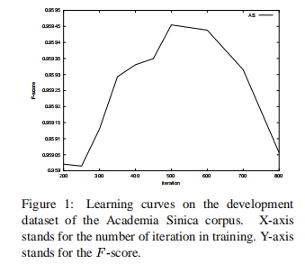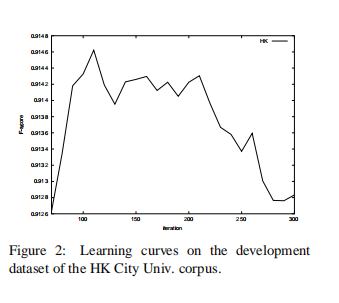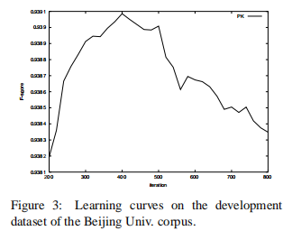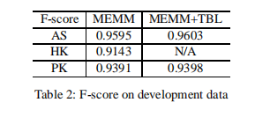

在 AS 上大约 400~500 次迭代达到最佳，在 HK 上大约 160 次达到最佳（实际上有波动，作者认为是因为 HK 的语料来源多个不同领域），在 PK 上在 400～500 次达到最佳。并且，从 Table 2 中看出，双向 TBL 并没有给 F-score 带来很多提高。。

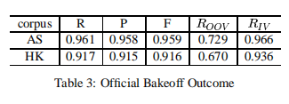

因为 Beijing Uern. 的语料库格式是 GBK, 和其他的语料库格式不同，导致系统不认识，F-score 更低 2% , 因此作者没有放上去。。。


   