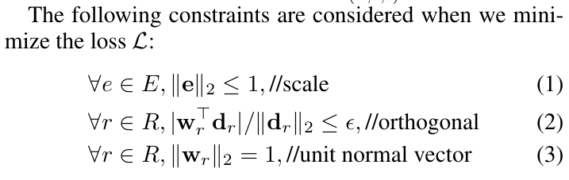
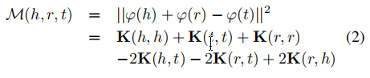
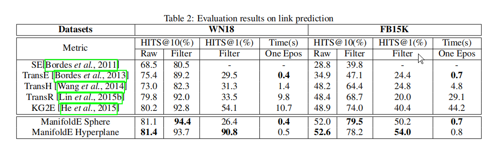
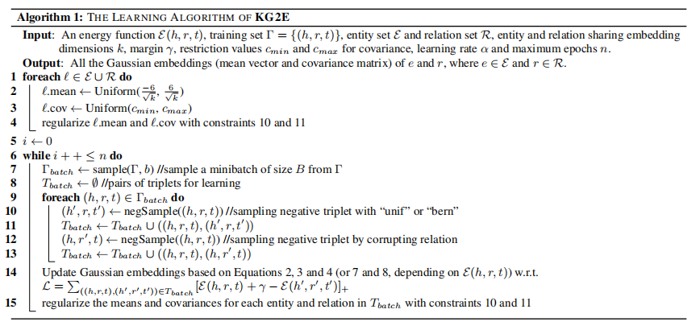
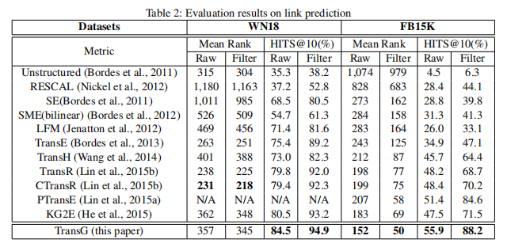

# 知识图谱的知识表示学习-TransX 系列

Knowledge Grapph Representation & Embedding,  KGR, KGE.

知识图谱嵌入是将知识图谱中的实体(entities) 和关系(relations) 编码到一个低维连续向量空间，并且最大程度的保存知识图谱的潜在结构。

据 [1]， 目前多数可用技术是基于知识图谱存储的事实( facts stored in KG )来编码，典型的编码步骤如下：

i.  representing entities and relations,

ii. defining a scoring function,

iii. learning entity and relation representations.

Quan Wang et al. 在 [1] 中将目前的 embedding 技术分成两种类型：*距离向量模型 ( translational distance models )*, *语义匹配模型 ( semantic matching models )* .

本篇主要描述了 translational distance models.

<!-- more -->

## Translational Distance Models

距离向量模型是基于距离( distance-based )的打分函数。

### TransE

法国康皮涅科技大学 ( Université de Technologie de Compiègne, UTC.fr ) 的 Antoine Bordes et al. 在 [2] 中提出   `TransE`.  TransE 是一种基于能量( energy ) 的用于学习实体( entities ) 在低维连续空间中的向量表示的模型。

**Basic idea**: *l-labeled* edges corresponds to a translation of the embeddings.( 即关系表示在向量空间中的位移。 ) 如果事实 *(h, l, t)* 成立, 那么尾实体向量 *t* 应该靠近于 头实体向量 *h* 加上关系向量 *l* ，e.g. $h + l \approx t$  .

**Notations**:  training set $S: (h, l, t)$, $h ,t \in E, l \in L$.  $k:$ hyperparameter of the embeddings.

**Energy function:**  $d(h+l, t)$ , $d$ 常用 $L1-norm$ 或者 $L2-norm$ .


其中，$||h||_2^2 = ||t||_2^2 = 1$ , 而 $||l||_2^2$ 在 currupt triples 中不起到关键作用。即：
$$
f_r(h, t) = ||h+r-t||_{1/2}, \\
w.r.t \quad ||h||_2 = 1, \,  ||t||_2 = 1 .
$$
L1: $d = abs(h+r-t).sum()$

对 $h$ 求导：$\frac{\partial d}{\partial h} = sum(sign(h+r-t))$.

对$t$ 求导：$\frac{\partial d}{\partial t} = -sum(sign(h+r-t))$.

对$r$ 求导：$\frac{\partial d}{\partial r} = sum(sign(h+r-t))$.

L2: $d = (h+r-t)^T(h+r-t).sum()$

对 $h$ 求导：$\frac{\partial d}{\partial h} = 2sum(h+r-t)$.

对 $t$  求导：$\frac{\partial d}{\partial t} = -2sum(h+r-t)$.

对 $r$  求导：$\frac{\partial d}{\partial t} = 2sum(h+r-t)$.

**Loss function** : 


其中， $\gamma$ 是超参数， $S^`_{(h, l, t)}$ 是 *currupted triplets*.  打分函数只统计正距离。

**Optimization method**: stochastic gradient descent (in minibatch mode).  + L2-norm constraint for enties, with no regulazation for labels.

**Algo 1**: 


- 初始化：为每一个实体和关系使用 [原文 4] 中的方法随机初始化(torch.nn.init.xavier_uniform)。关系向量需要归一化。(在 OpenKE 中，将 实体和关系向量都放到迭代中归一化)。

- 迭代：每次迭代需要先将实体向量归一化( normalize ) ; 然后，采样 batch, 对每个 triple 生成对应 currupt triplets：*{(h, l, t), (h', l', t')}*.  需要注意的是，根据后文中的讨论，这里生成的 currupt triples 需要进行过滤，以防 currupt triples 也出现在 datasets 中。（包括 training set, validating set, testing set. ）最后，利用 SGD update embeddings.

**Code**: 在 http://goo.gl/0PpKQe。(失效！)

**Experiments**:

数据集：WN18, FB15K, FB1M. 在训练过程中，Currupting Triplets 也可能出现在 Knowlegde graph 中，因此需要把这部分训练数据从训练集中剔除。没有剔除的训练集称为 `raw`, 剔除后的训练集称为 `filt.`. 

在 `链接预测` 任务上 TransE 的表现：


Optimal configurations were: $k = 20$, $λ = 0.01$, $γ = 2$, and $d = L1$ on Wordnet; $k = 50$, $λ = 0.01$, $γ = 1$, and $d = L1$ on FB15k; $k = 50$, $λ = 0.01$, $γ = 1$, and $d = L2$ on FB1M. For all data sets, training time was limited to at most 1, 000 epochs over the training set. 

TransE 与 Baseline 之间的参数数量对比：


OpenKE 上实现的TransE，参数为：d = 200, alpha = 1.0, p_norm = 1, train_times = 1000，最终的结果：

```
no type constraint results:
metric:                  MRR             MR              hit@10          hit@3           hit@1 
l(raw):                  0.089080        569.558411      0.204681        0.085654        0.033714 
r(raw):                  0.248875        168.295654      0.439314        0.270058        0.155722 
averaged(raw):           0.168978        368.927032      0.321997        0.177856        0.094718 

l(filter):               0.189340        315.928040      0.362064        0.211619        0.105199 
r(filter):               0.386719        142.252563      0.594107        0.436871        0.279195 
averaged(filter):        0.288030        229.090302      0.478086        0.324245        0.192197 
0.478086
0.47808557748794556
```

**Limitations**:  不能很好的处理关系的一些属性，比如 reflexive, one-to-many, many-to-one, many-to-many.

### TransH

对于 TransE 的缺陷，其他复杂模型虽然可以保留这些 mapping properties,但是牺牲了效率。为了权衡  capacity 和 efficiency, Wang Zhen  et al. 在 [3] 中提出 *translation on hyperplane*, `TransH`,  将关系( relations )建模成超平面( hyperplane ) 上的位移( translation )操作。这样既可以保留 mapping properties 也可以保持和 TransE  相当的模型复杂性。另外，由于 KG 通常是不完全（not completed）的，因此在训练过程中如何构建负样本( negative examples ) 并减少`假阴性标签`( false negative  label )是很重要的。

**Overcoming flaws of TransE **: 在 TransH 中，每个关系由两个向量表示：the *norm* vector ($w_r$) of the hyperplane, and the *translation* vector ($d_r$) on the hyperplane.  对于一个 golden triple *(h, r, t)*, 希望 $h$ 和 $t$ 在 超平面上的投影( *projections* ) 以位移向量 $d_r$ 相连，并错误最小。

**Translation on Hyperplane**:  As illustrated in Figure 1, for a relation r, we position the relation-specific translation vector $d_r$ in the relation-specific hyperplane $w_r$ (the normal vector) rather than in the same space of entity embeddings. Specially, 对于一个三元组 (h, r, t)，the embedding h and t 首先投影到超平面 $w_r$ 上，投影分别表示为 $h_{\perp}$, $t_{\perp}$. 我们希望 $h_{\perp}$, $t_{\perp}$可以由在 hyperplane 上的位移向量 $d_r$ 连接，并且使得错误最小。


**Score function**: 
$$
f(h, t) = ||h_{\perp} + d_r - t_{\perp}||_2^2, \\
w.r.t. \quad ||w_r||_2 = 1 .\,  h_{\perp} = h - w_r^T h w_r, \, t_{\perp} = t - w_r^T t w^r .
$$
**Training**: Margin-based ranking loss function:
$$
L = \sum_{(h, r, t) \in \Delta} \sum_{(h`, r`, t`) \in \Delta^`_{(h, r, t)}} [f(h, t) + \gamma - f(h`, t`)]_+
$$
, where  $γ$ is the margin separating positive and negative triplets.



于是将 loss function 通过soft constraints转换成如下的无约束的loss:


其中，$C$  is a hyper-parameter weighting the importance of soft constraints. 最后，利用 SGD 训练。

**Simple trick to reduce False Negative Labeling**:  在 TransH 中，在 currupting triples 时根据关系( relation )的 mapping  properties 为替换头实体 h 和 尾实体 t 设置不同的概率。当映射关系是 *one-to-many* 时，替换头实体 h 的概率大些；当映射关系是 *many-to-one* 时，则替换尾实体 t 的概率大些。这样产生假阴性标签的概率将会减小。具体做法如下：首先统计每个关系 r 的三元组，得到两个统计数据：(1) 每个头实体对应的平均尾实体数( the average number of tail entities per head entity ), 表示为 *tph* ；(2) 每个尾实体对应的平均头实体数( the average number of head entities per tail entity ), 表示为 *hpt*. 然后为采样( sampling ) 定义一个 Bernouli Distribution 参数： $\frac{tph}{tph + hpt}$。 给定一个 golden triple *(h, r, t)*, 以 $\frac{tph}{tph + hpt}$ 的概率替换头实体，以 $\frac{hpt}{tph + hpt}$ 的概率替换尾实体。不使用伯努力分布采样的为 `unif.`,  否则称为 `bern.` .

**Experimemts**: TransH 一共在 3 个任务上进行实验：link prediction,  triplets classification, relational fact extraction . 

**Link Prediction**:

Evaluation protocol: *mean-rank*, *Hits@10*. 

符号表示： $\alpha$ , SGD learning rate; $\gamma$, the margin; $k$, the embedding dimension; $C$, the weight; $B$, the batch size. 最佳参数设置：Under the “unif” setting, the optimal configurations are: $α = 0.01$, $γ = 1$, $k = 50$, $C = 0.25$, and $B = 75$ on WN18; $α = 0.005$, $γ = 0.5$, $k = 50$, $C = 0.015625$, and $B = 1200$ on FB15k.   Under “bern” setting, the optimal configurations are: $α = 0.01$, $γ = 1$, $k = 50$, $C = 0.25$, and $B = 1200$ on WN18; $α = 0.005$, $γ = 0.25$, $k = 100$, $C = 1.0$, and $B = 4800$ on FB15k. For both datasets, we traverse all the training triplets for 500 rounds.

Datasets： WN18, FB15k.


Result ：


其中, `unif.` 表示头实体和尾实体替换概率相同，`bern.` 表示头实体尾实体按照 bernouli 概率替换。在 WN18 数据集上，TransE 和 TransH 表现都很好；在  FB15k 数据集上，TransH 表现很好。


可以看到，TransH 在具有 side 1 特征的mapping properties 的关系上表现比其他都好，并且在 1-to-1 关系上也比其他方法表现好。

**Triplets Classification**:

Evaluation protocol: Accuracy.

Datasets: WN11, FB13, FB15k.

Optimal Configurations：The optimal configurations of TransE (bern.) are: $α = 0.01$, $k = 20$, $γ = 2.0$, $B = 120$, and $L1$ as dissimilarity on WN11; $α = 0.001$, $k = 100$, $γ = 2.0$, $B = 30$, and $L1$ as dissimilarity on FB13; $α = 0.005$, $k = 100$, $γ = 2.0$, $B = 480$, and $L1$ as dissimilarity on FB15k. The optimal hyperparameters of TransH (bern.) are: $α = 0.01$, $k = 100$, $γ = 2.0$, $C = 0.25$, and $B = 4800$ on WN11; $α = 0.001$, $k = 100$, $γ = 0.25$, $C = 0.0625$, and $B = 4800$ on FB13; $α = 0.01$, $k = 100$, $γ = 0.25$, $C = 0.0625$, and $B = 4800$ on FB15k.  Since FB15k is relatively large, we limit the number of epochs to 500.

Results: 


由表格 6可见，TransE, TransH 在 WN11 数据集上表现好，NTN 在 FB13 数据集上表现好，TransH 在 FB15k 上表现好。其中，FB13 比 FB15k 更加稠密( dense )，entities 间存在强关联( strong coorelations ). 因此利用 tensor 和 nonlinear transformer 的复杂模型有利于 embedding. 而在 FB15k 这样较为稀疏的 ( sparse ) 的图谱上使用  TransH 已经足够。

**Relational Fact Extraction from Text**: 不想看了。。。

**Limitation**: 

### TransR

TransE 和 TransH 模型都是假设 entities 和 relations 向量在同一语义空间 $\mathbb{R}^k$ 中，但实际上，每个 entity 可能具有多个方面( aspect )，而不同的 relations 可能关注 entity 的不同方面。为解决这个问题，Lin, Yankai, et al. [4] 提出 `TransR`, 为实体和关系分别构建实体空间和(多个)关系空间。然后，在学习 embedding 时，首先将 entities 从 entity space 投影到对应的 relation space 中，在关系空间中建立两个投影向量的位移( translation )。（因此称为 TransR）

**Source Code**: https://github.com/mrlyk423/relation_extraction or https://github.com/thunlp/KB2E.

**Basic Idea**:  如图1, 头实体 $h$ 和尾实体 $t$ 通过 $M_r$ 操作投影到 *r-relation space*， 分别为 $h_r$, $t_r$ , 然后使得 $h_r + r \approx t_r$ . 


**Score function**:  在 TransR 中, 对每一个三元组 *(h, r, t)*， 头实体和尾实体向量 $h, t \in \mathbb{R}^k$, 关系向量 $r \in \mathbb{R}^d$ ，注意 $k$ 不一定与 $d$ 相等。对每一个关系 $r$， 设置一个投影矩阵 $M_r \in \mathbb{R}^{k \times d}$,  可以将实体投影到关系空间中。定义实体的投影向量如下： 
$$
h_r = h M_r , t_r = t M_r
$$
。于是打分函数变成了  $f_r(h,t) = ||h_r + r - t_r||_2^2$ . 


**CTransR**: 对于某个关系， *head-tail*  pair 可能具有不同的表现模式，仅仅使用一个关系向量来执行 head 到 tail 实体的转换是远远不够的( TransE, TransH, TransR )。例如关系 "location_location_contains"，存在多种模式: country-city, country-university, continent-country等。在 [4] 中扩展了 TransR, 将 *head-tail* pair 聚类成组，然后对每一个 group 学习对应的 relation vector, 命名为 *cluster-based* TransR (CTransR)。

利用 TransE 得到实体的向量, 对每个实体对 *(h, t)* 使用 vector offset *(h - t)* 进行聚类。然后，对每一个 group 学习relation vector $r_c$,  对每个 relation 学习一个投影矩阵 $M_r$, 定义投影向量：$h_{r,c} = h M_r$ , $t_{r, c} = t M_r$,  打分函数定义为:  $f_r(h, t) = ||h_{r,c} + r_c - t_{r,c}||_2^2 + \alpha ||r_c -  r||_2^2$.


其中 $\alpha$ 控制约束的影响。

**Training**: 目标函数：$L = \sum_{(h,r,t) \in S} \sum_{(h`, r`, t`) \in S`} max(0, f_r(h ,t) + \gamma - f_r(h`. t`))$. 

To avoid overfitting, we initialize entity and relation embeddings with results of TransE, and initialize relation matrices as identity matrices. 

**Experiments**: [4] 进行了 3 项任务: Link Prediction, Triplet Classification, Relation Fact Extraction.

**Link Prediction**:  Datasets: WN18, FB15k.   Optimial Configuration: The optimal configurations are $λ = 0.001$, $γ = 4$, $k = 50$, $d = 50$, $B = 1440$, $α = 0.001$ and taking $L1$ as dissimilarity on WN18; $λ = 0.001$, $γ = 1$, $k = 50$, $d = 50$, $B = 4800$, $α = 0.01$ and taking $L1$ as dissimilarity on FB15K. For both datasets, we traverse all the training triplets for 500 rounds.

Reults:  (1) TransR， CTransR 比其他模型表现更好；(2) CTransR 比 TransR 模型表现更好些，说明应该微调模型以处理每个关系内部的复杂关联；(3) the "bern." simple trick 在 TransH 和 TransR 上都很有效。


对于关系的 mapping properties, 从 table 3 中可以看出，在 1-to-1 上的表现持续提高，在 “side one” 属性上的表现也比其他模型提高了许多。（用many预测 one 的Hits@10 已经很高了）


**Triple Classification**:  For a triple (h, r, t), if the dissimilarity score obtained by fr is below δr , the triple will be classified as positive, otherwise negative. δr is optimized by maximizing classification accuracies on the validation set.

Optimal configuration: The optimal configurations are: $λ = 0.001$, $γ = 4$, $k, d= 20$,  $B = 120$ and taking $L1$ as dissimilarity on WN11; $λ = 0.0001$, $γ = 2$,$ k, d = 100$ and $B = 480$ and taking $L1$ as dissimilarity on FB13. For both datasets, we traverse all the training triples for 1000 rounds.

Results: 在 WN11 上， TransR 表现明显比 TransE, TransH 好；(2) 在 FB13 上，NTN 模型的表现最好， 在 FB15k 上，TransE 系列表现比 NTN 好；(3) the simple trick "bern." 提高了 TransE, TransH, TransR 的表现。

在训练时间方面，TransE, TransH 分别需要 5min 和 30min, 而复杂模型 TransR 花费了近 3 个小时训练。(实际上，我用自己的电脑在 FB15K 数据集上跑 OpenKE 实现的 TransE，一个 batch 耗时39s, 一个 epoch 耗时约 70 分钟。)


**Relation Extraction from Text**: 不想看了。。

Future work:  (1) 使用 关系 之间的关联，比如 (金鱼, kinds_of, 鱼), (鱼, kind_of, 动物), 由于关系 kind_of 具有传递性(transitive) 就可以得到 (金鱼, kind_of, 动物). 应该充分利用这些关系模式。(2) CTransR 只是关系类型内部关联的一个小微调，以后可以尝试更加复杂的调整。

**Limitation**:  (1) 在同一关系 $r$ 下，头实体尾实体使用相同的投影举矩阵 $M_r$, 而头实体尾实体可能类别和属性相差很大，这些实体应该使用不同方法映射；(2) 投影过程是关系和实体的交互过程，投影矩阵 $M_r$ 仅与关系 $r$ 有关不合理；(3) ( 当关系数量多时 )参数多，（matrix-vector multiplications）计算复杂度高。由于这些缺陷，TransR/CTransR 难以适用于大规模知识图谱。（来源于 TransD 原文）

### TransD

为了克服 TransR 以上的缺点，中科院自动化所 NLPR 实验室的刘康、赵军老师等人在2015年提出了一种 TransR/CTransR 的 fine-grained 版本：`TransD` .  

CTransR 相比于 TransR 就是多考虑了同一关系也可能具有不同的类型，实际上，实体也具有不同类型。由于实体也有不同的类型，因此使用同一映射矩阵是不合理的，比如（刘康，工作单位，中科院自动化所），刘康 和 中科院自动化所 是不同类型，应该用不同的矩阵映射；而且映射矩阵不应该只和关系有关，还应该和实体有关。


**Model**: 在 TranD 中，为每一个 entities 和 relations 定义两个vectors, 第一个 vector 是用来表示 entity/relation 的意义的( the meaning of an entity or  an relation), 第二个 vector （称为 *projection vector*）是用来表示如何将 entity embedding 投影到 relation vector space中，并且将用于构建 mapping matrix. 这样，每个 entity-relation 都是一个唯一的 mapping matrix. 

例如，对一个三元组 *(h, r, t)*,  它对应的向量为 $h, h_p, r, r_p, t, t_p$ (注，这里的向量都是 列向量), 下标  $p$ 表示这是投影向量。$h, h_p, t, t_p \in \mathbb{R}^n$, $r, r_p \in \mathbb{R}^m$ . 于是得到两个 mapping matrix:  $M_{rh}, M_{rt} \in \mathbb{R}^{m \times n}$  将实体映射到关系向量空间。映射矩阵定义为: 
$$
M_{rh} = r_p h_p^T + I^{m \times n} \\
M_{rt} = r_p t_p^T + I^{m \times n}
$$
再定义实体的投影向量如下：
$$
h_{\perp} = M_{rh} h = h + h_p^T h r_p, t_{\perp} = M_{rt} t = t + t_p^T t r_p
$$
于是：

**Score function**:  
$$
f_r(h, t) = - || h_{\perp} + r - t_{\perp} ||_2^2
$$


**Experiments**: 进行了两项任务 Link prediction, Triplet classification.

**Link prediction**: The best configuration obtained by valid set are: $γ = 1$, $m, n = 50$, $B = 200$ and taking $L2$ as dissimilarity. For both the two datasets, We traverse to training for 1000 rounds.

Results: TransD 在两个数据集上表现都比其他数据集要好，TransD 与  TransR/CTransR 结果相近但是更好。


TransD 在关系的mapping properties上，比 TransR 的 Hits@10 提高了 7.4% 。


**Triplets classification**: The best configuration obtained by valid set are: $γ = 1$, $m, n = 100$, $B = 1000$ and taking $L2$ as dissimilarity on WN11; $γ = 1$, $m, n =100$, $B = 200$ and taking $L2$ as dissimilarity on FB13; $γ = 2$, $m, n = 100$, $B = 4800$ and taking $L1$ as dissimilarity on FB15k. For all the three datasets, We traverse to training for 1000 rounds. 

Results: 在 WN11 和 FB15k，TransD 比其他模型表现好；在 FB13，TransD 的表现仅次于 NTN.


Table 6 and 7 show that the same category objects have similar projec- tion vectors.  另外，TransD 将 matrix-vector operation 替换成了 vector operations。

**Limitations**: 暂无。

### TransSparse

TransE, TransH, TransR, TransD 方法都忽略了异构性( heterogeneity，有些关系连接有许多实体对，有些没有 ) 和不均匀性（imbalance, 关系中的头实体和尾实体的数量可能不同）。异构性会导致简单的关系过拟合，复杂关系欠拟合；头尾实体数量不均衡暗示将头尾视作平等是不合理的。为解决上述两个问题，中科院自动化所NLPR实验室刘康、赵军老师等人2015年在 [5] 中提出 `TransSparse`。 TransSparse 中不同复杂性的关系需要不同表示能力模型去学习，并且关系两端实体也需要分别建模。 

---

接下来的方法是放松位移要求 $h+r  \approx t$ 的方法。

### TransM 

TransE 可以很好的解决 1-to-1 关系的问题，但是不能很好的解决 many-to-1, 1-to-many, many-to-many 关系的问题。而实际知识图谱中，大约只有 26.2% 的 1-to-1 事实，因此其他73.8%的事实需要其他方法解决。清华大学 Miao Fan et al. [7] 在 2014年提出 `TransM`, 通过给每个事实（的关系）一个权重，可以放宽 TransE 中 score function 的约束。如图1：


**Score function**: 
$$
f_r(h,t)=w_r|h+r-t|_{L1/L2}
$$
**Loss function**:   margin-based hinge loss function
$$
L = min \sum_\limits{(h, r, t) \in \Delta} \sum_\limits{(h', r, t')\in \Delta’} [\gamma + f_r(h,t) - f_r(h', t')]_{+} ,\quad s.t. V e \in E, ||e||_2 = 1.
$$
其中， $[\quad]_+$ 是 *hinge loss function*. $[x]_+ = max(x, 0)$. 

**Degree of mapping property for a relation**: 对每个关系，统计得到唯一头(尾)实体对应的平均尾(头)实体数量。记为：$h_r p t_r$: heads per tail. $t_r p h_r$: tails per head. 于是，关系对应的权重为：
$$
w_r = \frac{1}{log(h_rpt_r + t_rph_r)}.
$$


**Alogrithm**: 对比 TransE, 需要在迭代前 pre-calculate 关系的 weight.


更新向量时，使用 SGD 更新。line 19 表示  golden triple 的 score 比 corrupted triple 的 score 还高（即错的更离谱），需要更新这个triple 的向量。

**Experiments**: 论文做了两个任务: link-prediction, triple-classification.

**Link-Prediction**: 数据集: WN18, FB15K. 最优参数: $d = 20$, $ \gamma= 2.0$, $s = 0.01$ for WN18 dataset; $d = 50$, $\gamma = 1.0$, $s = 0.01$ for FB15K dataset. 


可以看出， TransM 优于 TransE 模型。

**Triple-classification**: 数据集 WN11, FB13 FB15K. 最优参数: 同链接预测参数。


在稀疏图谱中, TransM 表现最好. 在 FB15K 数据集上测试， *L1*  形式的 score function 表现最好。

### TransF

为了解决 TransE 的问题， 清华大学 Jun Feng et al. [8] 提出了一种新的 score function, 不同于 $h+r \approx t$, TransF 只要求 $h+r$ (或$t-r$) 的方向与 $t$(或 $h$) 的方向相同，从而实现了 $h+r \approx \alpha $ 或 $t- r \approx \alpha h$.  


如图1(b),  3个 tail entity 的方向相同，但是向量大小(长度， magnitudes)不同。

**Method**: *Flexible Translation* (FT).  

**Score function**: $f_r(h, r) = (h+r)^T t + h^T (t-r)$ . 因此，golden triple 的 score 要比 corrupted triple 高。

**Experiment**: 只进行了 triple-classification. Benchmarks: WN18, WN11, FB13. 


结果表示 TransE-FT 模型完胜所有其他 baseline 模型，并且使  TransH, TransR 模型也得到了提升，证明 FT 的优越性和泛化能力。

### TransA

清华大学 M Huang et al. [9] 在 2015 提出 `TransA`, 也是一种不同的 score function, 具有更大的灵活性。

**Score function**:   $f_r(h,t) = (|h+r-t|)^T W_r (|h+r-t|)$, 

其中 $|h+r-t| = (|h1+r1-t1|, |h2+r2-t2|, ..., |hn + rn -tn|)$,  $W_r$ 是关系相关的对称非负矩阵( symmetric non-negative weight matrix )。 注意这里的 |h + r -t| 是取每个元素的绝对值的意思。

在等势面(Equipotential Surface)角度上看，传统的等势面为: $||(t-h)-r||_2^2 = C$ , 即 Euclidean distance;  而 TransA 的等势面为：$|(t-h)-r|^T W_r |(t-h)-r| = C$, 即 Mahalanobis diatance of absolute loss.

由于 $W_r$ 是对称非负矩阵，可以分解成：$L^TDL$ 形式.
$$
W_r = L_r^T D_r L_r ; D_r = diag(w_1, w_2, ..., w_d) ;\\
f_r(h, t) = (L_r |h+r-t|)^T D_r (L_r |h+r-t|)
$$
**Loss function**: 


**Training**: 每一次迭代，$W_r$ 可以通过求偏导数得到；为了使 $W_r$ 保持非负性质，直接将负数的部分设成 0 。


**Experiments**: 论文做了两个任务： Link-prediction,  triple-classification.  论文提出一个词叫 `ATPE`, 即 Averaged Triple number Per Entity, 用于评估数据集的多样性和复杂性。


**Link-prediction**:  Under the “bern.” sampling strategy, the optimal configurations are: learning rate $α = 0.001$, embedding dimension $k = 50$, $γ = 2.0$, $C = 0.2$ on WN18; $α = 0.002$, $k = 200$, $γ = 3.2$, and $C = 0.2$ on FB15K.


**Triple Classification**: The optimal configurations are: “bern” sampling, $α = 0.02$, $k = 50$, $γ = 10.0$, $C = 0.2$ on WN11, and “bern” sampling, $α = 0.002$, $k = 200$, $γ = 3.0$, $C = 0.00002$ on FB13. 


TransA 在更为多样复杂的数据集上表现更好。

### Manifold

为了解决 TransE 不适用( ill-posed )的代数系统和过于严格的几何形式，清华大学 Xiao et al. 在 2015 年提出`Manifold` 。从代数的角度，TransE 使用等式 $h_r + r = t_r$  编码向量会使得等式的数量（即事实的数量）大于等式中自由变量的数量（即实体和关系向量中的参数数量). 在 manifold 中通过限制 $d \gt \frac{T}{E+R} $ , 即 $ (E+R)*d > T $ , 使得实现 well-posed algebraic system 。从几何的角度，TransE 使用的 score function 使得 golden facts 集中在一点，而 manifold 可以将 golden facts 分散在高维球面( Sphere ), 即有： $M(h,r,t) = D_r^2$.  $h+r$ 是球体的中心，$t$ 是分散在球面的实体，$D_r$ 是球体的半径。


**Score function**: $$f_r(h, t) = ||M(h, r, t) - D_r^2||^2$$, 

其中，$M(h, r, t)$ 是 manifold function： $\mathbb{E} \times \mathbb{L} \times \mathbb{E} \rightarrow \mathbb{R}$, $D_r$ 是关系有关的 manifold 参数。 

- Sphere: 球体对应的 manifold function: $ M(h,r,t) = ||h+r-t||_2^2 $ . Reproducing Kernel Hilbert Spacing (RKHS) 可以提供更加丰富的 manifold 表达，引入核函数到 hilbert spacing 中的球体：

  

  其中 $K$ 是核函数，如 linear kernel: $K(a,b)=a^Tb$, Guassian kernel: $K(a,b)=e^{-\frac{||a-b||^2}{\theta^2}}$, Polynomial kernel: $K(a,b) = (a^Tb+d)^p$ 。

- Hyperplane: 超平面对应的 manifold function: $M(h,r,t)=(h + r_{head})^T(t+r_{tail})$.  对应的核函数写法为：$M(h,r,t) = K(h+r_{head}, t+r_{tail})$ .

**EXperiments**: Link-prediction, Triple-classification.

**Link-prediction**: Under the “bern.” sampling strategy, the optimal configurations of ManifoldE are as follows. For sphere, $α = 0.001$, $k = 100$, $γ = 3.0$, Linear kernel, on WN18; $α = 0.0005$, $k = 800$, $γ = 1.0$, Polynomial kernel(p = 2, d = 2) on FB15K. For hyperplane, learning rate $α = 0.01$, embedding dimension $k = 800$, margin $γ = 0.2$, Linear kernel, on WN18; $α = 0.01$, $k = 1000$, $γ = 0.2$, Linear kernel, on FB15K. The experimental environment is a common PC with i7-4790 CPU, 16G Memory and Windows 10.




可以看出，$d>\frac{T}{E+R}$ 的有效性和 manifold 的有效性。

**Triple classification**:  The optimal configurations of ManifoldE are as follows with “bern” sampling. For sphere, $α = 0.001$, $k = 100$, $γ = 10.0$, Linear kernel on WN18; $α = 0.00005$, $k = 1000$, $γ = 0.3$, Gaussian kernel ($σ = 1.0$) on FB13. For hyperplane, learning rate $α = 0.01$, embedding dimension $k = 500$, margin $γ = 1.0$, Linear kernel, on WN18; $α = 0.001$, $k = 1000$, $γ = 3.0$, Polynomial kernel ($p = 2$, $d = 2$), on FB13.


---

其他方法。

### UM

Bordes et al. 2011 [11]  提出一种用于从知识库的 raw text 训练学习得到 *MR* ( *meaning representation* )  方法，最终用于 WSD (word sense disambiguation )。

在 WordNet 中，论文将一个词表示成*_word_POS_N* 形式，这样可以区分一个词同一词性的不同意义。

UM  的 Semantic  Enerty Matching 过程如下：

Input triplets: $x = ((lhs_1, lhs_2, ...), (rel_1, rel_2, ...), (rhs_1, rhs_2,...))$. 

1.  输入的 triples 中每个symbol映射成 $E_i \in \mathbb{R}^d$ . 

2. 相同 tuple 的所有symbols 的embeddings 用聚合函数(pooling function) $\pi$ 聚合.
   $$
   E_{lhs} = \pi (E_{lhs_1}, E_{lhs_2}, ...); \\ 
   E_{rel} = \pi (E_{rel_1}, E_{rel_2}, ...); \\ 
   E_{lhs} = \pi (E_{rhs_1}, E_{rhs_2}, ...).
   $$
   
3. 构建新的关系相关的表示：
   $$
   E_{lhs} (rel)  = g_{left}(E_{lhs}, E_{rel}); \\
   E_{rhs} (rel)  = g_{rihgt}(E_{rhs}, E_{rel}).
   $$
   
4. 计算 energy:  $\varepsilon (x) = h(E_{lhs}(rel), E_{rhs}(rel))$ . 


由后续的实验，$g$ 采用 bilinear layers, $h$ 采用 dot product. 即，


### SE

Bordes et al. 2011 [12] 提出一种神经网络结构的知识表示过程，并且利用 Kernel Density Estimation 评估结果。在 [12] 中首次使用了 WN11 和 FB13 数据集。

**Structure Embeddings**:  (1) 对任意$e_i$, 映射成向量 $E_i \in \mathbb{R}^d$. (2) 对任意给定关系类型，都有一个特斯嗯的 similarity measure。由于 similarity 通常不是对称的，因此 $R_k = (R_k^{lhs}, R_k^{rhs})$, $R_k$ 是 $d \times d$ 矩阵。

**Similarity function**: score function, $S_k(E_i, E_j) = ||R_k^{lhs} E_i - R_k^{rhs} E_j||_p$. 

**Neural Network Arch**: training set: $x_1 = (e_1^l, r_1, e_1^r), ..., x_m = (e_m^l, r_m, e_m^r)$ .  

training objective( loss function ): $f(e_i^l, r_i, e_i^r) < f(e_j, r_i, e_i^r) \quad or \quad f(e_i^l, r_i, e_j)$ ， 即： $f(e_i^l, r_i, e_i^r) = ||R_{r_i}^{lhs} Ev(e_i^l) - R_{r_i}^{rhs} Ev(e_i^r)||_1$ . 使用 1-norm. $R_r^{lhs}, R_r^{rhs}: d \times d \times D_r$, $E: d \times D_e$ , 即为列向量。

**Training**: 

1. 如果 $f(x_i) > f(x^{neg}) - 1$, 则 make a gradient step to minimize $max(0, 1-f(x^{neg} + f(x_i)))$. 
2. 强制 $||E_i|| = 1$ .

**Probability landscape estimation**: 使用 Kernel Density Estimation(KDE)来完成 Ranking task . 论文中使用 Guassian kernel: 


于是，kernel density estimator 定义为：


于是，ranking or predictation:  $\hat{e}^r = argmax \quad x_{e \in D_e} f_{kde}((e_l,, r, e))$  .

**Experiments**: ranking.

**Ranking**: All methods based on embeddings share the same hyperparameters: $d = 50$, $λ = 0.01$ and have been trained for $1.5 × 10^9$ updates (which takes ≈ 3 days). For KDE, $σ^2 = 0.5$.


### PTransE


### KG2E

TransE 系列模型总是认为 entity / relation 具有相同的 manner, 而忽略了他们的（不）确定性((un)certainty). 清华大学 Shihu He et al. 2015 [13].  提出一种基于密度的（density-based） embedding. 并提出 `KE2G`, 建模实体和关系的不确定性。KG2G 有两层含义：1) Knowledge graph to Embedding; 2) Knowledge graph with Guassian Embedding. 

KG2G 将 KG 用多元高斯分布表示：$entity/relation \sim N(\mu, \Sigma) $. The mean 用于表示位置，the covariance 用于表示 uncertainty.   *(h, r, t)* 对于分布表示为 $(\mathcal{H}, \mathcal{R}, \mathcal{T})$， 有：$\mathcal{H} \sim N(\mu_h, \Sigma_h)$, $\mathcal{R}$ 和 $\mathcal{T}$ 同理。

训练框架（learning framework）: Ranking loss. 也是 transX 系列通用的学习框架。

Guassian Embedding for a KG:

1.  TranxE 中关系是头实体到尾实体的位移的思想，entity transformation: $\mathcal{H} - \mathcal{T}$.  对应概率分布为： $\mathcal{P}_e \sim N(\mu_h - \mu_t, \Sigma_h + \Sigma_t)$ (假设头实体尾实体相互独立)。 

2. 关系的概率分布为：$\mathcal{R} \sim N(\mu_r, \Sigma_r)$. 

3. **Score function**: 

   * **KL-divergence**: 相互熵，用于衡量两个概率分布之间的距离。非对称相似度衡量函数。
     $$
     \varepsilon(h, r, t) = \varepsilon(\mathcal{P}_e, \mathcal{P}_h) = \mathcal{D}_{KL} (\mathcal{P}_e, \mathcal{P}_r) \\
     = \int_{x\in R^{k_e}} N(x; \mu_r, \Sigma_r) log \frac{N(x; \mu_e, \Sigma_e)}{N(x; \mu_r, \Sigma_r)} dx \\
     = \frac{1}{2} \{tr(\Sigma_r^{-1} \Sigma_e) + (\mu_r - \mu_e)^T \Sigma_r^{-1} (\mu_r - \mu_e) \\ - log \frac{det(\Sigma_e)}{det(\Sigma_r)} -k_e\}. \dots (1)
     $$
     这里有一段十分精彩的梯度推导：$\frac{\partial\, log \, det\, A}{\partial A} = A^{-1} $; $\frac{\partial \, x^T A^{-1}y}{\partial A} = -A^{-T} xy^T A^{-T}$; $\frac{\partial \, tr(X^T A^{-1}Y)}{\partial A} = -(A^{-1}YX^TA^{-1})$. 于是，

     

   * **Expected likelihood**: 期望似然。对称的相似度衡量函数。
     $$
     \varepsilon({\mathcal{P}_e, \mathcal{P}_r}) = \int_{x\in\mathcal{R}^k_e} N(x; \mu_e, \Sigma_e) N(x; \mu_r, \Sigma_r) dx \\
     = N(0; \mu_e-\mu_r, \Sigma_e + \Sigma_r).
     $$
     为了便于计算，使用 log 函数转换, 表示为 EL.
     $$
     \varepsilon{h,r,t} = \varepsilon(\mathcal{P}_e, \mathcal{P}_r) = log \mathcal{N}(0; \mu_e-\mu_r, \Sigma_r+\Sigma_r) \\
     = \frac{1}{2} \{(\mu_e-\mu_r)^T (\Sigma_e+\Sigma_r)^{-1} (\mu_e - \mu_r) \\ +log\, det (\Sigma_e + \Sigma_r) + k_e log(2\pi)\}. \dots (6)
     $$
     对应导数为：

     

     

4. **Loss function**: $\mathcal{L} = \sum_{(h,r,t)\in \Gamma} \sum_{(h', r', t') \in \Gamma'} [\varepsilon(h,r,t) + \gamma + \varepsilon(h',r',t')]_+ \dots (9)$. 

   regularization term:  

   在训练时，可以用 $\sum_{ii} \leftarrow max(c_{min}, min(c_{max}, \sum_{ii})). $ 实现 (11)。

   

**Experiments**: 链接预测 和 元组分类。

**Link-prediction**: 在 WN18 和 FB15K 数据集上，比 state-of-art 方法 CTransR 实现了略高的表现。并且非对称的score function KL 要比对称的 EL 表现要好。


**Triple classification**: KG2E_KL 实现了和 state-of-art 差不多的表现。。。


### TransG

HanXiao et al. 2016 [14] 提出TransX系列都没有关注到*mupltiple relation semantic* 的问题，将 TransE 的 embedding vector 用 PCA 维度约减，在二维图像上，一个 triple 表示一个 point，明显一个 relation 具有多个 clusters ，因此验证了作者的多元关系语义的假设。为了解决这个问题，作者提出 `TransG`. 


TransG 可以自动挖掘关系的多层语义，并且利用 mixture of multiple relation components 来表示 entity pair 的位移。

**模型的生成过程**：

1. 对每一个实体 $e \in E$:
   1. Draw each entity embedding mean vector from a standard normal distribution as a prior: $\mu_e \sim \mathcal{N}(0,1)$.
2. 对每个事实 $(h,r,t) \in \Delta$: 
   1. 用中餐馆模型（Chinese Restaurant Process, CRP）抽取关系的语义(概率)：$\pi_{r, m} \sim CRP(\beta)$ ; 
   2. 从标准分布抽取头实体 embedding: $h \sim \mathcal{N}(\mu_h, \sigma_h^2 E)$; 
   3. 从标准分布抽取尾实体 embedding: $t \sim \mathcal{N}(\mu_t, \sigma_t^2 E)$ ;
   4. 为该关系的语义抽取 embedding: $\mu_{r, m} = t - h \sim \mathcal{N}(\mu_t - \mu_h, (\sigma_h^2 + \sigma_t^2)E )$ . 

其中， $\mu_h, \mu_t$ 分别表示头实体尾实体的 mean, $\sigma_h, \sigma_t$ 分别表示实体分布的 variance , $\mu_{r, m}$ 表示关系 $r$ 的第 $m$ 个语义的 translation vector. CPR 是一个 狄利克雷过程(Dirichlet process), 可以自动的探测关系的语义。

**Score function**: 


**新关系语义的概率**： 


**Loss function**:  最大化 golden triple 与 corrupted triple 的似然比。


模仿 TransE 的对更新的限制， TransG 中当满足条件(5) 时才更新：


**Experiments**: Link-prediction, Triple-classification. 

**Link prediction**: Under the “bern.” sampling strategy, the optimal configurations are: learning rate
$α = 0.001$, the embedding dimension $k = 100$, $γ = 2.5$, $β = 0.05$ on WN18; $α = 0.0015$, $k = 400$, $γ = 3.0$, $β = 0.1$ on FB15K. Note that all the symbols are introduced in “Methods”. We train the model until it converges. 




**Triple classification**:  “bern” sampling, learning rate $α = 0.001$, $k = 50$, $γ = 6.0$, $β = 0.1$ on WN11, and “bern” sampling, $α = 0.002$, $k = 400$, $γ = 3.0$, $β = 0.1$ on FB13.


**KG2E vs. TransG**: KG2E 是建模 entity / relation 的不确定性，而 TransG 是建模关系的多元语义。

**CTransR vs. TransG**: CTransR 是在训练前做为每个关系内的语义聚类，再进行训练；而 TransG 是在训练过程利用 CRP （中餐馆）模型得到关系的多元语义，训练和聚类同时进行。


### 总结

#### TransX 图示


高斯混合分布的图没有画。

#### 参数比较

TransX 以及神经网络模型空间复杂度和时间复杂度：( Wang et al. 2017 [1] )


在 TransX 系列模型中，TransE 效率最高，TransR 最复杂。

#### Tricks

在 TransX 系列中，用了几个技巧可以提高模型的表现。

1. `filt.` :  在训练过程中，Currupting Triplets 也可能出现在 Knowlegde graph 中，因此需要把这部分训练数据从训练集中剔除。没有剔除的训练集称为 `raw`, 剔除后的训练集称为 `filt.`. 
2. `bern.` : 由于 KG 通常是不完全（not completed）的，因此在训练过程中如何构建负样本( negative examples ) 并减少`假阴性标签`( false negative  label )是很重要的。 在 TransH 中，在 currupting triples 时根据关系( relation )的 mapping  properties 为替换头实体 h 和 尾实体 t 设置不同的概率。 给定一个 golden triple *(h, r, t)*, 以 $\frac{tph}{tph + hpt}$ 的概率替换头实体，以 $\frac{hpt}{tph + hpt}$ 的概率替换尾实体。不使用伯努力分布采样的为 `unif.`,  否则称为 `bern.` .

#### Score fucntion

TransX 系列 score function 总结如下：

| Method                                | Ent. embedding                                               | Rel. embedding                                               | Scoring function $f_r(h, t)$                                 | Constraints / Regularization                                 | Remarks                                                      |
| ------------------------------------- | ------------------------------------------------------------ | ------------------------------------------------------------ | ------------------------------------------------------------ | ------------------------------------------------------------ | ------------------------------------------------------------ |
| TransE, Bordes et al. 2013, [2]       | $h, t \in \mathbb{R}^d$                                      | $r \in \mathbb{R}^d$                                         | $-||h+r-t||_{1/2}$                                           | $||h||_2 = 1$,  $||t||_2 = 1$                                | - 存在 "many-side" 问题<br />-过滤在golden triple 中的 corrupt triple，分成 *raw* 和 *filt.* |
| TransH, Wang et al. 2014, [3]         | $h, t \in \mathbb{R}^d$                                      | $r \in \mathbb{R}^d$                                         | $h_{\perp} = h - w_r^T h w_r$; <br />$t_{perp} = t - w_r^T t w_r$; <br />$-||h_{\perp} + d_r - t_{\perp}||_2^2$ | $||h||_2 \leq 1$; $||t||_2 \leq 1$<br />$|w_r^T d_r|/||d_r| \leq \epsilon$ <br />$||w_r||_2 = 1$ | - 每个关系由$w_r$ 和 $d_r$ 两个向量表示.<br />- 提出 *bern.* 技巧，减少假阴性标签 |
| TransR, Lin, Yankai, et al. 2015, [4] | $h, t \in \mathbb{R}^k$                                      | $r \in \mathbb{R}^d$, $M_r \in \mathbb{R}^{k \times d}$      | $h_r = hM_r$, $t_r = tM_r$<br />$-||h_r + r - t_r||_2^2$     | $||h||_2 \leq 1$, $||t||_2 \leq 1$, $||r||_2 \leq 1$<br />$||hM_r||\leq1$, $||tM_r||\leq 1$ | -关系由位移向量$r$ 和映射矩阵 $M_r$ 组成，实体向量需要映射到向量空间<br />- 提出 CTransR，为每个关系的语义聚类 |
| TransD, Ji et al. 2015, [5]           | $h, h_p \in \mathbb{R}^n$, <br /> $t, t_p \in \mathbb{R}^n$  | $r, r_p \in \mathbb{R}^m$                                    | $M_{rh} = r_p h_p^T + I^{m\times n}$,  $M_{rh} \in \mathbb{R}^{m\times n}$<br />$M_{rt} = r_p t_p^T + I^{m \times n}$, $M_{rt} \in \mathbb{R}^{m\times n}$; <br />$h_{\perp} = M_{rh}h$, $t_{\perp} = M_{rt}t$;<br />$-||h_{\perp} + r - t_{\perp}||_2^2$ | $||h||_2 \leq 1$ , $||t||_2 \leq 1$ , $||r||_2 \leq 1$; <br />$||h_{\perp}||_2 \leq 1$ , $||t_{\perp}||_2 \leq 1$ | - 考虑实体使用同一映射矩阵不合理<br />- 每个实体和关系都由两个列向量组成 $e, e_p$ |
| TransM, Fan et al.2014, [7]           | $h,t \in \mathbb{R}^d$                                       | $r \in \mathbb{R}^d$                                         | $- w_r ||h + r-t||_{1/2}$ , <br />$w_r = \frac{1}{h_r p t_r + t_r p h_r}$ | $||h||_2 = 1$ , $||t||_2 = 1$                                | - 放松 TransE 的条件<br />- 预计算每个triple的权重           |
| TransF, Feng et al. 2016, [8]         | $h, t \in \mathbb{R}^d$                                      | $r \in \mathbb{R}^d$+r                                       | $(h+r)^Tt + (t-r)^T h$                                       | $||h||_2 \leq 1$ , $||t||_2 \leq 1$ , $||r||_2 \leq 1$       | - 只要求 (h+r) 的方向与 t 相同, 大小不同<br />- 可以和 TransX 系列方法结合 |
| TransA, Xiao et al. 2015, [9]         | $h, t \in \mathbb{R}^d$                                      | $r \in \mathbb{R}^d$ , $W_r \in \mathbb{R}^{d \times d}$     | $-(|h+r-t|)^T W_r (|h+r-t|) $                                | $||h||_2 \leq 1$ , $||t||_2  \leq  1$ , $||r||_2 \leq 1 $ ; <br />$||W_r||_F \leq 1$ , $[W_r]_{ij}  = [W_r]_{ji} \geq 0$ | - 等势面为绝对值的马氏距离<br />- 比 manifold 更加灵活<br />-提出 *ATPE* 用于衡量数据集的多样性和复杂性 |
| Manifold,   Xiao et al. 2015, [10]    | $h, t \in \mathbb{R}^d$                                      | $r \in \mathbb{R}^d$                                         | $-(||h+r-t||_2^2 - D_r^2)^2$                                 | $|||h|_2 \leq 1$ , $||t||_2 \leq 1$ , $||r||_2 \leq 1$       | - 可以使用 核函数，映射到希伯尔特空间                        |
| UM, Bordes et al. 2012, [11]          | $h, t \in \mathbb{R}^d$                                      |                                                              | $-||h - t||_2^2$                                             | $||h||_2 = 1$ , $||t||_2 = 1$                                | - TransE 的简化版本                                          |
| SE, Bordes et al. 2011, [12]          | $h, t \in \mathbb{R}^d$                                      | $R_k^{lhs}, R_k^{rhs} \in \mathbb{R}^{d \times d}$           | $-||R_k^{lhs} E_i - R_k^{rhs} E_j||_1$                       | $||h||_2 =1$ , $||t||_2 = 1$                                 |                                                              |
| KG2E, Shihu He et al. 2015, [13]      | $h \sim \mathcal{N}(\mu_h, \Sigma_h)$ <br />$t \sim \mathcal{N}(\mu_t, \Sigma_t)$<br />$\mu_h, \mu_t \in \mathbb{R}^d$ <br />$\Sigma_h , \Sigma_t \in \mathbb{R}^{d \times d}$ | $r \sim \mathcal{N}(\mu_r, \Sigma_r)$<br />$\mu_r \in\mathbb{R}^d$ , $\Sigma_r \in \mathbb{R}^{d \times d}$ | KL-divergence: $-\frac{1}{2} \{tr(\Sigma_r^{-1} \Sigma_e) + (\mu_r - \mu_e)^T \Sigma_r^{-1} (\mu_r - \mu_e) \\ - log \frac{det(\Sigma_e)}{det(\Sigma_r)} -k_e\}$ | $||\mu_h||_2, ||\mu_t||_2, ||\mu_r||_2 \leq 1$<br />$c_{min}I \leq \Sigma_h, \Sigma_t, \Sigma_r \leq c_{max}I$ | - 混合高斯分布衡量ent./rel. 的不确定性<br />-借用了 TransE 的位移函数 |
| TransG, HanXiao et al. 2016, [14]     | $h \sim \mathcal{N}(\mu_h,\sigma_h^2E)$<br />$t \sim \mathcal{N}(\mu_t,\sigma_t^2E)$<br />$\mu_h, \mu_t \in \mathbb{R}^d$ | $\mu_{r, m} = t - h \sim \mathcal{N}(\mu_t - \mu_h, (\sigma_h^2 + \sigma_t^2)E )$<br />$\pi_{r, m} \sim CRP(\beta)$<br />$r = \sum_m \pi_{r,m} \mu_{r, m} \in \mathbb{R}^d$ | $\sum_m \pi_{r,m} exp\{-\frac{||\mu_h + \mu_{r, m} - \mu_t||_2^2}{\sigma_h^2 + \sigma_t^2}\}$ | $||\mu_h||_2 \leq 1$ , $||\mu_t||_2 \leq 1$ , $||\mu_{r, m}||_2 \leq 1$ | - 用生成模型解决关系多语义的问题<br />- 用 CRP 自动抽取关系的语义 |


#### Link Prediction 

评估链接预测结果的常用 metrics 是 *mean rank* 和 *hits@10*, 其他的还有*hits@5*, *hits@1* 等。*mean rank* 就是要预测的正确实体的排序平均；*hits@n* 就是正确实体在top n的频率。

在链接预测任务上 TransX 的表现：

| **DATASET**                                   | **WN18**  |         |          |          | **FB15K** |        |          |          |
| --------------------------------------------- | --------- | ------- | -------- | -------- | --------- | ------ | -------- | -------- |
| Metric Eval                                   | MEAN RANK |         | HITS@10  |          | MEAN RANK |        | HITS@10  |          |
|                                               | Raw       | Filt.   | Raw      | Filt.    | Raw       | Filt.  | Raw      | Filt.    |
| TransE ( Bordes et al. 2013 [2])              | 263       | 251     | 75.4     | 89.2     | 243       | 125    | 34.9     | 47.1     |
| TransH(unif.) (Wang et al. 2014 [3])          | 318       | 303     | 75.4     | 86.7     | 211       | 84     | 42.5     | 58.5     |
| TransH(bern.) (Wang et al. 2014 [3])          | 400.8     | 388     | 73       | 82.3     | 212       | 87     | 45.7     | 64.4     |
| TransR(unif.) (Lin, Yankai, et al. 2015 [4])  | 232       | 219     | 78.3     | 91.7     | 226       | 78     | 43.8     | 65.5     |
| TransR(bern.) (Lin, Yankai, et al. 2015 [4])  | 238       | 225     | 79.8     | 92       | 198       | 77     | 48.2     | 68.7     |
| CTransR(unif.) (Lin, Yankai, et al. 2015 [4]) | 243       | 230     | 78.9     | 92.3     | 233       | 82     | 44       | 66.3     |
| CTransR(bern.) (Lin, Yankai, et al. 2015 [4]) | 231       | 218     | 79.4     | 92.3     | 199       | 75     | 48.4     | 70.2     |
| TransD(unif.) (Ji et al. 2015, [5])           | 242       | 229     | 79.2     | 92.5     | 211       | 67     | 49.4     | 74.2     |
| TransD(bern.) (Ji et al. 2015, [5])           | **224**   | **212** | 79.6     | 92.2     | 194       | 91     | 53.4     | 77.3     |
| TransM (Fan et al. 2014, [7])                 | 292.5     | 280.8   | 75.67    | 85.38    | 196.8     | 93.8   | 44.64    | 55.15    |
| TransA (M Huang et al. 2015, [9]])            | 405       | 392     | 82.3     | 94.3     | 155       | 74     | 56.1     | 80.4     |
| manifold(Sphere) (Xiao et al. 2015, [10])     |           |         | 81.1     | 94.4     |           |        | 52       | 79.5     |
| manifold(Hyperplane) (Xiao et al. 2015, [10]) |           |         | 81.4     | 93.7     |           |        | 52.6     | 78.2     |
| KE2G (Shihu He et al. 2015 [13])              | 342       | 331     | 80.2     | 92.8     | 174       | 59     | 48.9     | 74       |
| TransG (HanXiao et al. 2016 [14])             | 357       | 345     | **84.5** | **94.9** | **152**   | **50** | **55.9** | **88.2** |

TODO 描绘 mean rank, hits@10 走势图。

#### Triple Classification 

评估 Triple classification 的常用 metrics 是 *accuracy* 和 *recall*. 

TransX 在triple classification 上的准确率表现如下：

|                                               |          |          |           |                                                            |
| --------------------------------------------- | -------- | -------- | --------- | ---------------------------------------------------------- |
| **DATASET**                                   | **WN11** | **FB13** | **FB15K** | **Remark**                                                 |
| TransE(unif.) ( Bordes et al. 2013 [2])       | 75.9     | 70.9     | 77.3      | TransD 论文中抄录                                          |
| TransE(bern.) ( Bordes et al. 2013 [2])       | 75.9     | 81.5     | 79.8      | TransD 论文中抄录                                          |
| TransH(unif.) (Wang et al. 2014 [3])          | 77.68    | 76.5     | 80.2      |                                                            |
| TransH(bern.) (Wang et al. 2014 [3])          | 77.8     | 83.3     | 87.7      | FB15K 存疑，后面的论文都没有这么高的精度, TransD 中为 79.9 |
| TransR(unif.) (Lin, Yankai, et al. 2015 [4])  | 85.5     | 74.7     | 81.7      |                                                            |
| TransR(bern.) (Lin, Yankai, et al. 2015 [4])  | 85.9     | 82.5     | 83.9      |                                                            |
| CTransR(unif.) (Lin, Yankai, et al. 2015 [4]) |          |          |           |                                                            |
| CTransR(bern.) (Lin, Yankai, et al. 2015 [4]) | 85.7     |          | 84.5      |                                                            |
| TransD(unif.) (Ji et al. 2015, [5])           | 85.6     | 85.9     | 86.4      |                                                            |
| TransD(bern.) (Ji et al. 2015, [5])           | 86.4     | **89.1** | 88        |                                                            |
| TransM (Fan et al. 2014, [7])                 | 77.8     | 72.1     | **89.9**  |                                                            |
| TransF ( Jun Feng et al. 2016 [8])            | 86.6     | 82.9     | 88.9      |                                                            |
| TransA (M Huang et al. 2015, [9]])            | 83.2     | 87.3     | 85.3      |                                                            |
| manifold(Sphere) (Xiao et al. 2015, [10])     | **87.5** | 87.2     |           |                                                            |
| manifold(Hyperplane) (Xiao et al. 2015, [10]) | 86.9     | 87.3     |           |                                                            |
| KE2G (Shihu He et al. 2015 [13])              | 85.4     | 85.3     | 89.3      |                                                            |
| TransG (HanXiao et al. 2016 [14])             | 87.4     | 87.3     |           |                                                            |
| NTN                                           | 70.4     | 87.1     | 68.2      |                                                            |


## References

- [1] Q. Wang, Z. Mao, B. Wang, and L. Guo, “Knowledge Graph Embedding: A Survey of Approaches and Applications,” *IEEE Trans. Knowl. Data Eng.*, vol. 29, no. 12, pp. 2724–2743, Dec. 2017, doi: [10.1109/TKDE.2017.2754499](https://doi.org/10.1109/TKDE.2017.2754499).
- [2] A. Bordes, N. Usunier, A. Garcia-Duran, J. Weston, and O. Yakhnenko, “Translating Embeddings for Modeling Multi-relational Data,” in *Advances in Neural Information Processing Systems 26*, C. J. C. Burges, L. Bottou, M. Welling, Z. Ghahramani, and K. Q. Weinberger, Eds. Curran Associates, Inc., 2013, pp. 2787–2795. 
- [3] Wang Z, Zhang J, Feng J, et al. Knowledge graph embedding by translating on hyperplanes[C]//Twenty-Eighth AAAI conference on artificial intelligence. 2014.
- [4] Lin, Yankai, et al. "Learning entity and relation embeddings for knowledge graph completion." *Twenty-ninth AAAI conference on artificial intelligence*. 2015.
- [5] G. Ji, S. He, L. Xu, K. Liu, and J. Zhao, “Knowledge graph embedding via dynamic mapping matrix,” in *Proceedings of the 53rd Annual Meeting of the Association for Computational Linguistics and the 7th International Joint Conference on Natural Language Processing (Volume 1: Long Papers)*, 2015, pp. 687–696.
- [6] G. Ji, K. Liu, S. He, and J. Zhao, “Knowledge graph completion with adaptive sparse transfer matrix,” in *Thirtieth AAAI conference on artificial intelligence*, 2016.
- [7] M. Fan, Q. Zhou, E. Chang, and F. Zheng, “Transition-based knowledge graph embedding with relational mapping properties,” in *Proceedings of the 28th Pacific Asia Conference on Language, Information and Computing*, 2014, pp. 328–337.
- [8] J. Feng, M. Huang, M. Wang, M. Zhou, Y. Hao, and X. Zhu, “Knowledge graph embedding by flexible translation,” in *Fifteenth International Conference on the Principles of Knowledge Representation and Reasoning*, 2016.
- [9] H. Xiao, M. Huang, Y. Hao, and X. Zhu, “Transa: An adaptive approach for knowledge graph embedding,” *arXiv preprint arXiv:1509.05490*, 2015.
- [10] H. Xiao, M. Huang, and X. Zhu, “From one point to a manifold: Knowledge graph embedding for precise link prediction,” *arXiv preprint arXiv:1512.04792*, 2015.
- [11] A. Bordes, X. Glorot, J. Weston, and Y. Bengio, “Joint learning of words and meaning representations for open-text semantic parsing,” in *Artificial Intelligence and Statistics*, 2012, pp. 127–135.
- [12] A. Bordes, J. Weston, R. Collobert, and Y. Bengio, “Learning structured embeddings of knowledge bases,” in *Twenty-Fifth AAAI Conference on Artificial Intelligence*, 2011.
- [13] S. He, K. Liu, G. Ji, and J. Zhao, “Learning to represent knowledge graphs with gaussian embedding,” in *Proceedings of the 24th ACM International on Conference on Information and Knowledge Management*, 2015, pp. 623–632.
- [14] H. Xiao, M. Huang, and X. Zhu, “TransG: A generative model for knowledge graph embedding,” in *Proceedings of the 54th Annual Meeting of the Association for Computational Linguistics (Volume 1: Long Papers)*, 2016, pp. 2316–2325.


