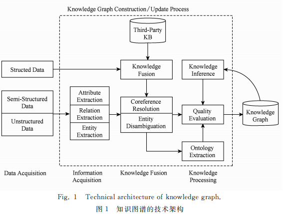
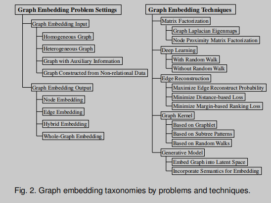
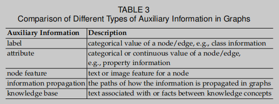
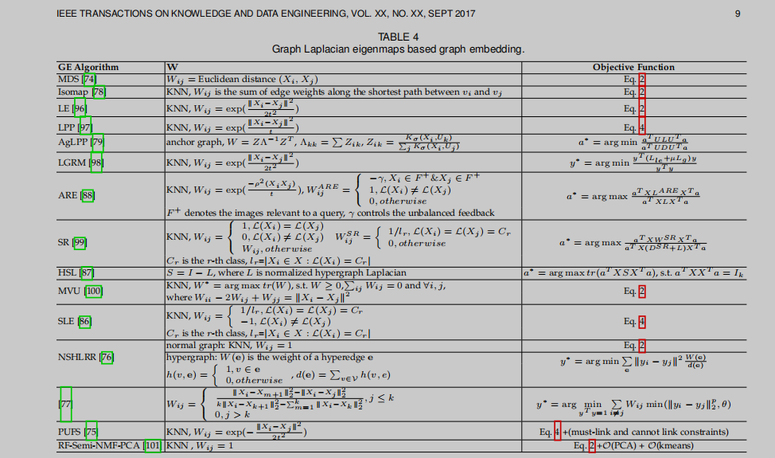
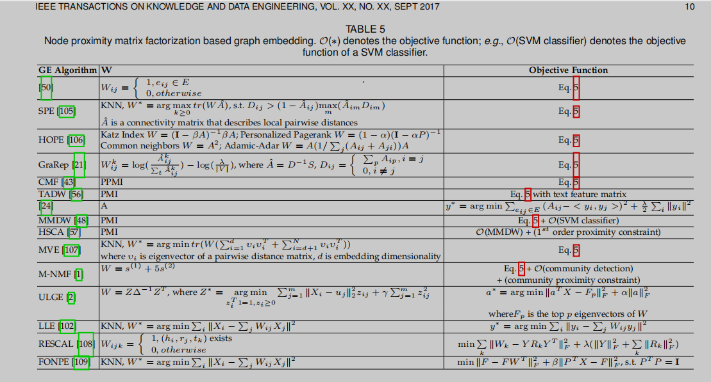
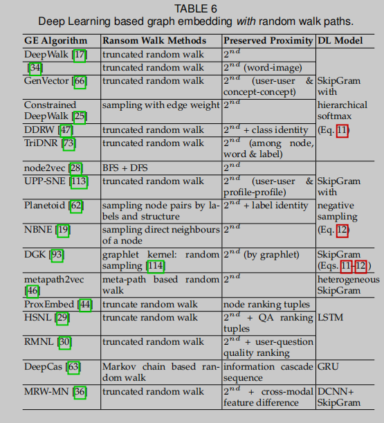
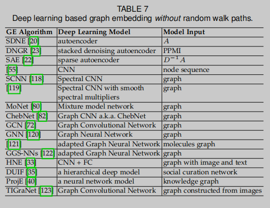
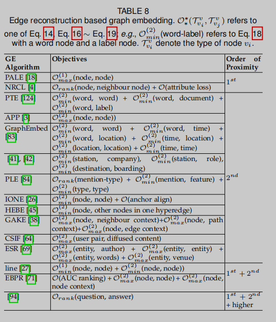
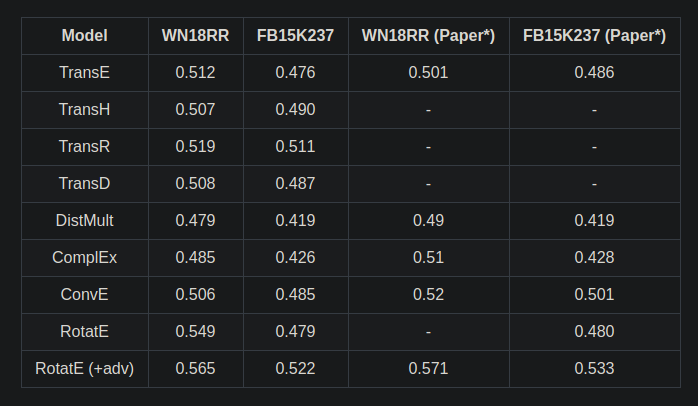

知识图谱， Knowledge Graph，一种以图形式组织的描述现实世界中实体和实体关系的模型。

Web 1.0 -> Web 2.0: 网页的链接 -> 数据的链接。

<!-- more -->

## 理论及论文

### Survey

目标：弄清楚如何构建 KG ， 构建技术中哪些部分是关键技术，难点，技术瓶颈是什么。

* [刘峤, 李杨, 段宏, 等. 知识图谱构建技术综述[J]. 计算机研究与发展, 2016, 53(3): 582-600.](http://crad.ict.ac.cn/CN/article/downloadArticleFile.do?attachType=PDF&id=3127)

* [徐增林, 盛泳潘, 贺丽荣, 等. 知识图谱技术综述[J]. 2016.](http://www.xml-data.org/dzkj-nature/html/201645589.htm)

  关键技术：

  - 知识抽取： 实体抽取，关系抽取，属性抽取

  - 知识表示

    虽然，基于**三元组的知识表示形式**受到了人们广泛的认可，但是其在计算效率、数据稀疏性等方面却面临着诸多问题。近年来，以深度学习为代表的表示学习技术取得了重要的进展，可以将实体的语义信息表示为稠密低维实值向量，进而在低维空间中高效计算实体、关系及其之间的复杂语义关联，对知识库的构建、推理、融合以及应用均具有重要的意义[[51](http://www.xml-data.org/dzkj-nature/html/201645589.htm#b51)-[53](http://www.xml-data.org/dzkj-nature/html/201645589.htm#b53)]。本文将重点介绍知识表示学习的代表模型、复杂关系翻译模型、多源异质信息融合模型方面的研究成果。

    1. 应用场景：**分布式表示**旨在用一个综合的向量来表示实体对象的语义信息，是一种模仿人脑工作的表示机制[[53](http://www.xml-data.org/dzkj-nature/html/201645589.htm#b53)]，通过知识表示而得到的分布式表示形式在知识图谱的计算、补全、推理等方面将起到重要的作用：

       1) 语义相似度计算。由于实体通过分布式表示而形成的是一个个低维的实值向量，所以，可使用熵权系数法[[54](http://www.xml-data.org/dzkj-nature/html/201645589.htm#b54)]、余弦相似性[[55](http://www.xml-data.org/dzkj-nature/html/201645589.htm#b55)]等方法计算它们间的相似性。这种相似性刻画了实体之间的语义关联程度，为自然语言处理等提供了极大的便利。

       2) 链接预测。通过分布式表示模型，可以预测图谱中任意两个实体之间的关系，以及实体间已存在的关系的正确性。尤其是在大规模知识图谱的上下文中，需要不断补充其中的实体关系，所以链接预测又被称为知识图谱的补全[[53](http://www.xml-data.org/dzkj-nature/html/201645589.htm#b53)]。

    2. 代表模型：主要包括距离模型、双线性模型、神经张量模型、矩阵分解模型、翻译模型等。 <!-- ！important --><!--  优缺点整理 -->

    3. 复杂关系模型

    4. 多源信息融合

  - 知识融合：

    1. 实体对齐（实体匹配，实体解析）：主要是用于消除异构数据中实体冲突、指向不明等不一致性问题，可以从顶层创建一个大规模的统一知识库，从而帮助机器理解多源异质的数据，形成高质量的知识。

    2. <!-- !important -->

       就是PPT中的知识融合。

    3. 知识加工
  
     1. **本体构建**： **本体**是同一领域内不同主体之间进行交流、连通的语义基础[[95](http://www.xml-data.org/dzkj-nature/html/201645589.htm#b95)]，其主要呈现树状结构，相邻的层次节点或概念之间具有严格的“IsA”关系，有利于进行约束、推理等，却不利于表达概念的多样性。本体在知识图谱中的地位相当于知识库的模具，通过本体库而形成的知识库不仅层次结构较强，并且冗余程度较小[[96](http://www.xml-data.org/dzkj-nature/html/201645589.htm#b96)]。
       2. 质量评估

    4. 知识更新
  
  - **知识推理**：基于逻辑的推理，基于图的推理
  
    **图处理算法**

[HongYun Cai, Vincent W. Zheng, and Kevin Chen-Chuan Chang, “A Comprehensive Survey of Graph Embedding: Problems, Techniques, and Applications,” *IEEE Transactions on Knowledge and Data Engineering* 30, no. 9 (September 2018): 1616–37, https://doi.org/10.1109/TKDE.2018.2807452.](https://doi.org/10.1109/TKDE.2018.2807452):

`Graph embedding` 的 survey:

The problem of graph embedding is related to two traditional research problems, i.e., graph analytics [8] and representation learning [9].

> Graph embedding aims to represent a graph as low dimensional vectors while the graph structures are preserved.
>
>  graph analytics aims to mine useful information from graph data.

The challenges of graph embedding depend on the **problem setting**, which consists of *embedding input*
and *embedding output*.

Input graph: four categories, including *homogeneous graph graph, graph with auxiliary information and graph constructed from non-relational data*.   Different types of embedding input carry different information to be preserved in the embedded space.

 The embedding output is task driven: four types,  including *node embedding*, *edge embedding*, *hybrid embedding* and *whole-graph embedding*. 

roblem setting -> challenges -> solution techniques.

* Homotgeneous graph: . All nodes in G belong to a single type and all edges belong to one single type
* Hetegeneous graph: Nodes and/or edges have different types.
* knowledge graph: triple facts: <head entity, relation, tail entity>.

Hence, knowledge graph can be viewed as an instance of the heterogeneous graph.

Table 3. Comparison of Different Types of Auxiliary Information in Graphs

**proximity measures**: to quantify the graph property to be preserved in the embedded space. 

* the *first-order proxoimity*:  $s_{i,j}^{(1)}$ between node $v_i$ and node $v_j$ is the weight of the edge $e_{ij}$ , i.e., $A_{i,j}$ .
* the *second-order proximity*: $s_{i,j}^{(2)}$ between node $v_i$ and $v_j$ is a similarity between $v_i$ ’s neighbourhood $s_i^{(1)}$ and $v_j$ ’s neighborhood $s_j^{1}$.
* the *higher-order proximity*:  the *k-th-order proximity* between node $v_i$ and $v_j$ is the similarity between $s_i^{(k-1)}$ and  $s_j^{k-1}$ ; or some other metrixs, e.g. *Katz Index*, *Root PageRank*, *Adamic Adar*, etc.

The first-order proximity is the local pairwise similarity between only the nodes connected by edges. 

The second-order proximity compares the similarity of the nodes’ neighbourhood structures. 

**Problem Settings**

1. Embedding input

| embedding input                           | Scenarios                                                    | Challenges                                                   |
| ----------------------------------------- | ------------------------------------------------------------ | ------------------------------------------------------------ |
| Homogeneous graph                         |                                                              | How to capture the diversity of **connectivity patterns** observed in graphs? |
| Heterogeneous graph                       | Community-based Question Anwsering (cQA) sites   Multimedia Networks   Knowledge graph  ... | How to explore **global consistency** between different types of objects, and how to **deal with the imbalances** of objects belonging to different types ( data skewness ), if any? |
| Graph with Auxiliary Information          | See Table 3.                                                 | How to **incorporate the rich and unstructured information** so that the learnt embeddings are both representing the topological structure and discriminative in terms of the auxiliary information? |
| Graph Constructed from Non-relatinal Data |                                                              | How to construct a graph that encodes the pairwise relations between instances and how to preserve the generated node proximity matrix in the embedded space? |

2. Embedding output

   Challenge One: how to **find a suitable type of embedding output** which meets the needs of the specific application task.

   | Embedding output      | Scenerios                                        | Challenges                                                   |
   | --------------------- | ------------------------------------------------ | ------------------------------------------------------------ |
   | Node Embedding        |                                                  | How to **define the pairwise node proximity*** in various types of input graph and how to encode the proximity in the learnt embeddings? |
   | Edge Embedding        | KG embedding                                     | How to **define the edge-level similarity** and how to **model the asymmetric property of the edges**, if any? |
   | Hybrid Embedding      | node + edge (Substructure)  node + community | How to **generate the target substructure** and how to **embed different types of graph components** in one common space? |
   | Whole-Graph Embedding | small graphs                                     | How to **capture the properties** of a whole graph and how to **make a trade-off between expressiveness and efficiency** ? |

**Graph Embedding Techniques**

The differences between different graph embedding algorithms lie in how they define the graph property to be preserved. 

1. Matrix Factorization

   1. Graph Laplacian Eigenmaps

      Insight: *The graph property to be preserved can be interpreted as pairwise node similarities. Thus, a larger penalty is imposed if two nodes with larger similarity are embedded far apart.*

      

      Objective function:

       $y^* = argmin \sum_{i \neq j}( y_i - y_j^2 W_{ij}) = argmin y^TLy \cdots (1)$ 

      $ L = D - W$;  D : the diagonal  matrix, $ D_{ii} = \sum_{j \neq i} W_{ij}$

      with constraint on: $ y^T D y = 1 $

      $(1) \Rightarrow y^* = argmin_{y^TDy=1} y^TLy = argmin \frac{y^TLy}{y^TDy} = argmax \frac{y^T W y}{y^T D y}  \cdots (2)$

      The optimal $y$’s are the eigenvectors corresponding to the maximum eigenvalue of the eigenproblem $$Wy = \lambda Dy$$.

      

      上面的方法只使用于 embde 一个 node, 对于 new comming nides, one solution is to design a linear function $y = X^T a$ . 

      $(1) \Rightarrow optimal a:  a*= argmin \sum_{i \neq j} \| a^TX_i - a^TX_j \|^2 W_{ij} = argmin \quad a^T XLX^Ta. \cdots (3)$  

      with constraint on $a^TXDX^Ta = 1.$

      $(3) \Rightarrow a* = argmin \frac{a^TXLX^Ta}{a^TXDX^Ta} = argmax \frac{a^TXWX^Ta}{a^TXDX^Ta}. \cdots (4)$

      The optimal a’s are eigenvectors with the maximum eigenvalues in solving $XWX^Ta = \lambda XDX^Ta$.

      

      相关研究：

      - T. Hofmann and J. M. Buhmann, “Multidimensional scaling and data clustering,” in NIPS, 1994, pp. 459–466. 
      - M. Balasubramanian and E. L. Schwartz, “The isomap algorithm and topological stability,” Science, vol. 295, no. 5552, pp. 7–7, 2002
      - W. N. A. Jr. and T. D. Morley, “Eigenvalues of the laplacian of a graph,” Linear and Multilinear Algebra, vol. 18, no. 2, pp. 141–145, 1985.
      -  X. He and P. Niyogi, “Locality preserving projections,” in NIPS, 2003, pp. 153–160
      -  S. T. Roweis and L. K. Saul, “Nonlinear Dimensionality Reduction by Locally Linear Embedding,” Science, vol. 290, no. 5500, pp. 2323–2326, 2000.
      - ] R. Jiang, W. Fu, L. Wen, S. Hao, and R. Hong, “Dimensionality reduction on anchorgraph with an efficient locality preserving projection,” Neurocomputing, vol. 187, pp. 109–118, 2016.
      - Y. Yang, F. Nie, S. Xiang, Y. Zhuang, and W. Wang, “Local and global regressive mapping for manifold learning with out-ofsample extrapolation,” in AAAI, 2010.
      -  S. Xiang, F. Nie, C. Zhang, and C. Zhang, “Nonlinear dimensionality reduction with local spline embedding,” IEEE Trans. Knowl. Data Eng., vol. 21, no. 9, pp. 1285–1298, 2009
      - D. Cai, X. He, and J. Han, “Spectral regression: a unified subspace learning framework for content-based image retrieval,” in MM, 2007, pp. 403–412.
      - X. He and P. Niyogi, “Locality preserving projections,” in NIPS, 2003, pp. 153–160.
      -  Y.-Y. Lin, T.-L. Liu, and H.-T. Chen, “Semantic manifold learning for image retrieval,” in MM, 2005, pp. 249–258.
      -  K. Allab, L. Labiod, and M. Nadif, “A semi-nmf-pca unified framework for data clustering,” IEEE Trans. Knowl. Data Eng., vol. 29, no. 1, pp. 2–16, 2017
      -  L. Vandenberghe and S. Boyd, “Semidefinite programming,” SIAM Rev., vol. 38, no. 1, pp. 49–95, 1996.
      - K. Q. Weinberger, F. Sha, and L. K. Saul, “Learning a kernel matrix for nonlinear dimensionality reduction,” in ICML, 2004.

      

      - [77] M. Tang, F. Nie, and R. Jain, “Capped lp-norm graph embedding for photo clustering,” in MM, 2016, pp. 431–435.

   2. Node Proximity Matrix Factorization

      Insight: Node proximity can be approximated in a lowdimensional space using matrix factorization. The objective of preserving node proximity is to minimize the loss of approximation.

      objective function: $min \| W - YY^{c^T}, \cdots (5)$ 

      node embedding: $ Y \in R^{|V| \times d}$, context node embedding: $ Y^{c} \in R^{|V| \times d}$.

      

      - [50] G. Nikolentzos, P. Meladianos, and M. Vazirgiannis, “Matching node embeddings for graph similarity,” in AAAI, 2017, pp. 2429–2435.
      - [24] A. Ahmed, N. Shervashidze, S. Narayanamurthy, V. Josifovski, and A. J. Smola, “Distributed large-scale natural graph factorization,” in WWW, 2013, pp. 37–48.

      

2. Deep Learning

   1. DL  with Random walk

      Insight: *The second-order proximity in a graph can be preserved in the embedded space by maximizing the probability of observing the neighbourhood of a node conditioned on its embedding.*

      

      DeepWalk [[17]](B. Perozzi, R. Al-Rfou, and S. Skiena, "Deepwalk: Online learning
      of social representations," in KDD, 2014, pp. 701–710) adopts a neural language model (SkipGram) for graph embedding. DeepWalk first samples a set of paths from the input graph using truncated random walk.   Each path sampled from the graph corresponds to a sentence from the corpus, where a node corresponds to a word. Then SkipGram is applied on the paths to maximize the probability of observing a node’s neighbourhood conditioned on its embedding.

      The objective function is： 

      $$ min_y -log P(\{v_{i-w}, \cdots, v_{i-1}, v_{i+1}, \cdots, v_{i+w}\} | y_i), \cdots (8) $$

      $w$ is the window size which restricts the size of random walk context. SkipGram removes the ordering constraint, 

      $$(8) \Rightarrow min_y -log \sum_{-w \leq j \leq w} P(v_{i+w} | y_i). \cdots (9)$$

      $P(v_{i+w} | y_i)$ is defined using softmax function: $P(v_{i+w} | y_i) = \frac{exp(y_{i+j}^T y_i)}{\sum_{k=1}^{|V|}exp(y_k^T y_i)}. \cdots (10)$

      Note that calculating Eq. 10 is not feasible as the normalization factor  ) is expensive. There are usually two solutions to approximate the full softmax: *hierarchical softmax* [[112]](T. Mikolov, I. Sutskever, K. Chen, G. S. Corrado, and J. Dean, "Distributed representations of words and phrases and theircompositionality," in NIPS, 2013, pp. 3111–3119.) and *negative sampling* [[112]](T. Mikolov, I. Sutskever, K. Chen, G. S. Corrado, and J. Dean, "Distributed representations of words and phrases and their compositionality," in NIPS, 2013, pp. 3111–3119.).

      

      相关研究：

      - Z. Jin, R. Liu, Q. Li, D. D. Zeng, Y. Zhan, and L. Wang, “Predicting user’s multi-interests with network embedding in health-related topics,” in IJCNN, 2016, pp. 2568–2575.
      - A. Grover and J. Leskovec, “Node2vec: Scalable feature learning for networks,” in KDD, 2016, pp. 855–864.
      -  Y. Dong, N. V. Chawla, and A. Swami, “metapath2vec: Scalable representation learning for heterogeneous networks,” in KDD, 2017, pp. 135–144.
      -  Z. Yang, W. W. Cohen, and R. Salakhutdinov, “Revisiting semisupervised learning with graph embeddings,” in ICML, 2016, pp. 40–48.
      - H. Zhang, X. Shang, H. Luan, M. Wang, and T. Chua, “Learning from collective intelligence: Feature learning using social images and tags,” TOMCCAP, vol. 13, no. 1, pp. 1:1–1:23, 2016
      - J. Li, J. Zhu, and B. Zhang, “Discriminative deep random walk for network classification,” in ACL, 2016.
      -  Z. Yang, J. Tang, and W. Cohen, “Multi-modal bayesian embeddings for learning social knowledge graphs,” in IJCAI, 2016, pp. 2287–2293.s
      -  S. Pan, J. Wu, X. Zhu, C. Zhang, and Y. Wang, “Tri-party deep network representation,” in IJCAI, 2016, pp. 1895–1901.
      - H. Fang, F. Wu, Z. Zhao, X. Duan, Y. Zhuang, and M. Ester, “Community-based question answering via heterogeneous social network learning,” in AAAI, 2016, pp. 122–128
      - Z. Zhao, Q. Yang, D. Cai, X. He, and Y. Zhuang, “Expert finding for community-based question answering via ranking metric network learning,” in IJCAI, 2016, pp. 3000–3006
      -  Z. Liu, V. W. Zheng, Z. Zhao, F. Zhu, K. C. Chang, M. Wu, and J. Ying, “Semantic proximity search on heterogeneous graph by proximity embedding,” in AAAI, 2017, pp. 154–160.

      

      -  [34] H. Zhang, X. Shang, H. Luan, M. Wang, and T. Chua, “Learning from collective intelligence: Feature learning using social images and tags,” TOMCCAP, vol. 13, no. 1, pp. 1:1–1:23, 2016.

      

   2. DL without Random walk

      Insight: *The multi-layered learning architecture is a robust and effective solution to encode the graph into a low dimensional space.*

      1. Autoencoder: An autoencoder aims to minimize the reconstruction error of the output and input by its encoder and decoder.

      2. Deep Neural Network: CNN.

         convolution operation:

         - Euclidean domains: 
           - M. Niepert, M. Ahmed, and K. Kutzkov, “Learning convolutional
             neural networks for graphs,” in ICML, 2016, pp. 2014–2023.
         - non-Euclidean domains: 
           - M. M. Bronstein, J. Bruna, Y. LeCun, A. Szlam, and P. Vandergheynst, “Geometric deep learning: going beyond euclidean data,” CoRR, vol. abs/1611.08097, 2016. {Survey}
           - Spectral domain: 
             -  J. Bruna, W. Zaremba, A. Szlam, and Y. LeCun, “Spectral networks and locally connected networks on graphs,” in ICLR, 2013.
             - M. Henaff, J. Bruna, and Y. LeCun, “Deep convolutional networks on graph-structured data,” CoRR, vol. abs/1506.05163, 2015.
           - spatial domain: 
             - T. N. Kipf and M. Welling, “Semi-supervised classification with graph convolutional networks,” in ICLR, 2017.
             - M. Defferrard, X. Bresson, and P. Vandergheynst, “Convolutional neural networks on graphs with fast localized spectral filtering,” in NIPS, 2016, pp. 3837–3845.
             -  F. Scarselli, M. Gori, A. C. Tsoi, M. Hagenbuchner, and G. Monfardini, “The graph neural network model,” IEEE Trans. Neural Networks, vol. 20, no. 1, pp. 61–80, 2009
           - 

      3. Others:

         - X. Geng, H. Zhang, J. Bian, and T. Chua, “Learning image and user features for recommendation in social networks,” in ICCV, 2015, pp. 4274–4282.
         -  S. Chang, W. Han, J. Tang, G.-J. Qi, C. C. Aggarwal, and T. S. Huang, “Heterogeneous network embedding via deep architectures,” in KDD, 2015, pp. 119–128
         - B. Shi and T. Weninger, “Proje: Embedding projection for knowledge graph completion,” in AAAI, 2017, pp. 1236–1242.

         总结表格：

      

      - [55]  M. Niepert, M. Ahmed, and K. Kutzkov, “Learning convolutional neural networks for graphs,” in ICML, 2016, pp. 2014–2023.
      - [119]  M. Henaff, J. Bruna, and Y. LeCun, “Deep convolutional networks on graph-structured data,” CoRR, vol. abs/1506.05163, 2015.
      - [121]  D. Duvenaud, D. Maclaurin, J. Aguilera-Iparraguirre, R. Gomez- ´ Bombarelli, T. Hirzel, A. Aspuru-Guzik, and R. P. Adams, “Convolutional networks on graphs for learning molecular fingerprints,” in NIPS, 2015, pp. 2224–2232

      

3. Edge Reconstruction based Optimization

   Overall Insight: *The edges established based on node embedding should be as similar to those in the input graph as possible.*

   1. Maximizing Edge Reconstruction Probability

      Insight: *Good node embedding maximizes the probability of generating the observed edges in a graph*. 

      

      *first-order* proximity:

      $p^{(1)}(v_i, v_j) = \frac{1}{1+exp(-y_i^T y_j)}. \cdots (13)$

      objective function is:

      $O^{(1)}_{max} = max \sum_{e_{i,j \in E} log p^{(1)}(v_i, v_j).  \cdots (14)}$

      *second-order* proximity:

      $p^{(2)}(v_j|v_i) = \frac{exp(y_j^T y_i)}{\sum_{k=1}^{|V|} exp(y_k^T y_i)}. \cdots (15)$

      objective function is:

      $O^{(2)}_{max} = max \sum_{\{v_i, v_j\} \in P } log p^{(2)}(v_j | v_i). \cdots (16)$

      

   2. Minimizing Distance-based Loss

      Insight: *The node proximity calculated based on node embedding should be as close to the node proximity calculated based on the observed edges as possible.*

      

      the empirical probability : 

      $\hat p^{(1)}(v_i, v_j) = A_{i,j} / \sum_{e_{i,j} \in E} A_{ij}$

      $\hat p^{(2)}(v_j|v_i) = A_{i,j} / d_i, \quad d_i = \sum_{e_{ik} \in E} A_{ik}$

      probability of node embedding : Eq. (13)

      the objective function ( Adopting KL-divergence as distance function): 

      $O^{(1)}_{min} = min -\sum_{e_{ij} \in E} A_{ij} log p^{(1)(v_i, v_j)}. \cdots (17)$

      $O^{(2)}_{min} = min -\sum_{e_{ij} \in E} A_{ij} log p^{(2)(v_j|v_j)}. \cdots (17)$

      

   3. Minimizing Distance-based Ranking Loss

      Insight: *A node’s embedding is more similar to the embedding of relevant nodes than that of any other irrelevant node.*

      $s(v_i, v_j)$: similarity score for node $v_i$ and $v_j$.

      $V_i^+$: the set of nodes relevant to $v_i$.

      $V_i^-$: the set of nodes irrelevant to $v_i$.

      The margin-based ranking loss: 

      $O_{rank} = min \sum_{v_i^+ \in V_i^+} \sum_{v_i^- \in V_i^-} max\{0, \gamma - s(v_i, v_i^+) + s(v_i, v_i^-)\}$

   

   - [41] M. Ochi, Y. Nakashio, Y. Yamashita, I. Sakata, K. Asatani, M. Ruttley, and J. Mori, “Representation learning for geospatial areas using large-scale mobility data from smart card,” in UbiComp, 2016, pp. 1381–1389
   - [42] M. Ochi, Y. Nakashio, M. Ruttley, J. Mori, and I. Sakata, “Geospatial area embedding based on the movement purpose hypothesis using large-scale mobility data from smart card,” IJCNS, vol. 9, pp. 519–534, 2016
   - [92]  A. Bordes, S. Chopra, and J. Weston, “Question answering with subgraph embeddings,” in EMNLP, 2014, pp. 615–620

   

4. Graph Kernel

   Insight: *The whole graph structure can be represented as a
   vector containing the counts of elementary substructures that are decomposed from it.*

   

   Graph kernel is an instance of *R-convolution kernels* [[136]]( D. Haussler, "Convolution kernels on discrete structures," Technical Report UCS-CRL-99-10, 1999), which is a generic way of defining kernels on discrete compound objects by recursively decomposing structured objects into “atomic” substructures and comparing all pairs of them [[93]](P. Yanardag and S. Vishwanathan, "Deep graph kernels," in KDD, 2015, pp. 1365–1374.).

   

   1. Graphlet: A graphlet is an induced and non-isomorphic subgraph of *size-k* [93]. Suppose graph $G$ is decomposed into a set of graphlets ${G_1, G_2, \cdots , G_d}$. Then G is embedded as a d-dimensional vector (denoted as $y_G$) of normalized counts. The $i$-th dimension of $y_G$ is the frequency of the graphlet $G_i$ occurring in $G$.
      
2. Subtree Patterns
   
   In this kernel, a graph is decomposed as its subtree patterns.
   
   
   
3. Random Walks:
   
   In the third type of graph kernels, a graph is decomposed into random walks or paths and represented as the counts of occurrence of random walks [137] or paths [138] in it. 
   
   
   
5. Generative Model

   1. Embed Graph Into The Latent Semantic Space
   2. Incorporate Latent Semantics for Graph Embedding ???

6. Hybrid Techniques and Others

### Information Extraction

- NERC
  - [Yadav V, Bethard S. A survey on recent advances in named entity recognition from deep learning models[J]. arXiv preprint arXiv:1910.11470, 2019.](https://arxiv.org/abs/1910.11470) :

- Evaluation
  - Accuracy
  - Recall
  - F-measure

### Knowledge Fusion

* Entity Disambiguation
* Co-reference Resolution 

### Knowledge Representation & Embedding

**注：**  *Network Representation*, *Network Embedding*, *Graph representation*, *Graph Embedding*, 以及 `Knowledge Graph Representation`, `Graph Embedding` 这些概念，虽然许多文献不会特意区分，但是有一些细微的区别。

个人见解：*Representaion* 的范围比 *Embedding*  广一点。比如 KG 中的 representation 包含 `RDF`, `OWL`, `Distribute Representation`等， 而 embedding 只是 *distribute repesentation* 的一种特例。

#### 基准测试

清华大学 OpenKE 的实现的基准测试结果(`Hit@10`, 测试方法详见项目的 GitHub 主页)：

表格左边两栏是 **THUN** 的实现的 `Hit@10` 结果，最后两栏是相关方法的 paper 中给出的 `Hit@10` 结果。最好的结果是 `RotatE(+adv)`。

### Store & Retrieve

### Knowledge Reasoning

### Knowledge Base Question & Answer

### Knowledge Completion & Error Detection

- [Paulheim H. Knowledge graph refinement: A survey of approaches and evaluation methods[J]. Semantic web, 2017, 8(3): 489-508.](http://www.semantic-web-journal.net/system/files/swj1167.pdf)
- 

 ### Knowledge Graph Evaluation

* `Mean Reank`
* `Mean reciprocal rank`
* `Hit@10`

## 图谱及数据集

- 数据集
  - FB15k
  - WN18
- 图谱

## 工具

Toolkits.

### 知识表示学习

- [清华大学 `OpenKE` 知识表示平台](https://www.jiqizhixin.com/articles/2017-11-04-2)
- 

